### EPAM University Programs  DevOps education program

# Module 2 Virtualization and Cloud Basic
TASK 2.1
## PART 1. HYPERVISORS
1. What are the most popular hypervisors for infrastructure virtualization?

2. Briefly describe the main differences of the most popular hypervisors.

## PART 2. WORK WITH VIRTUALBOX
1. First run VirtualBox and Virtual Machine (VM).

1.1 Get acquainted with the structure of the user manual VirtualBox [1] (see list of references in the end of the document)

1.2 From the official VirtualBox site [2] download the latest stable version of VirtualBox according to the host operating system (OS) installed on the student's workplace. For Windows, the file may be called, for example, VirtualBox-6.1.10-138449-Win.exe. Install VirtualBox.

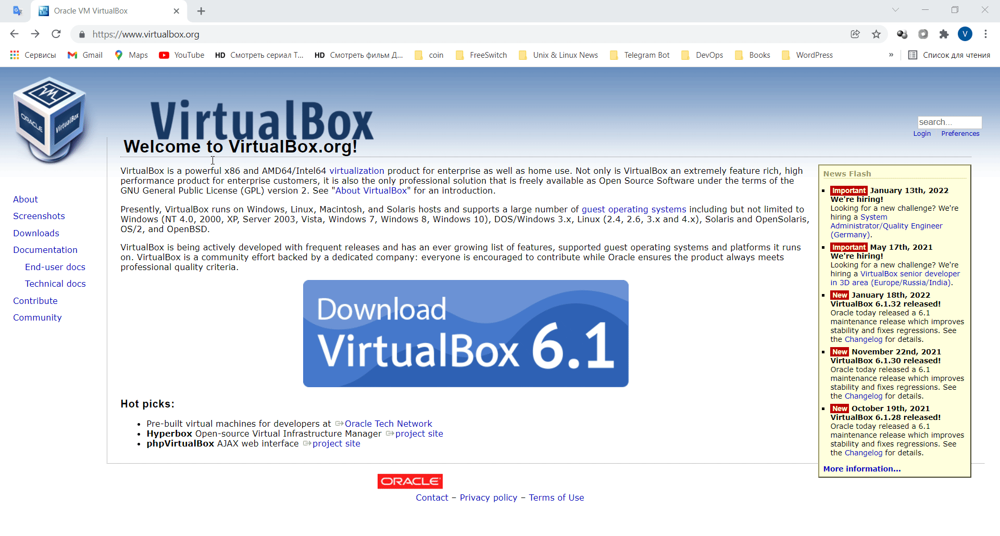
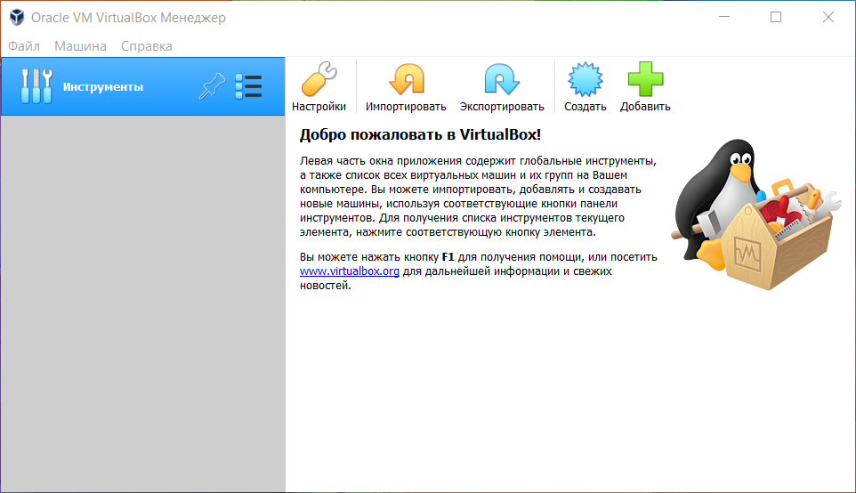
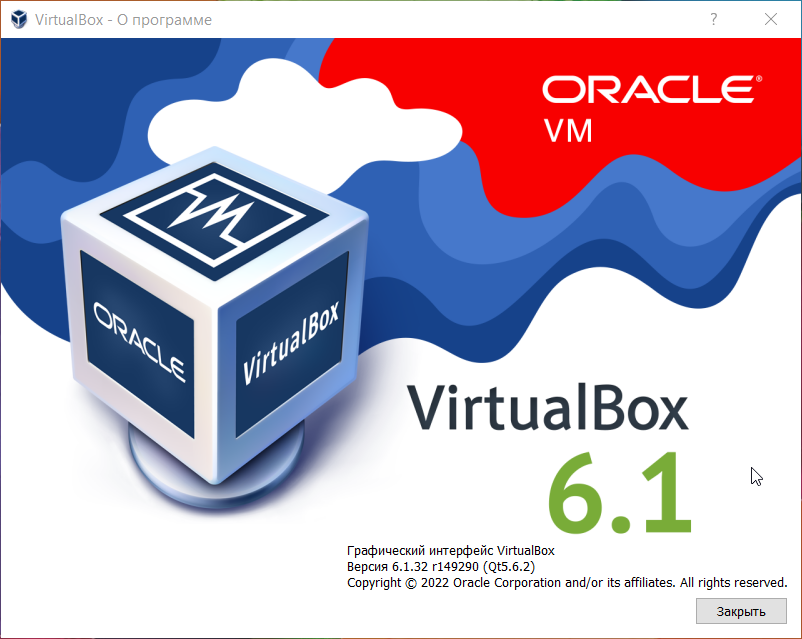

1.3 Download the latest stable version of Ubuntu Desktop or Ubuntu Server from the official site [3].

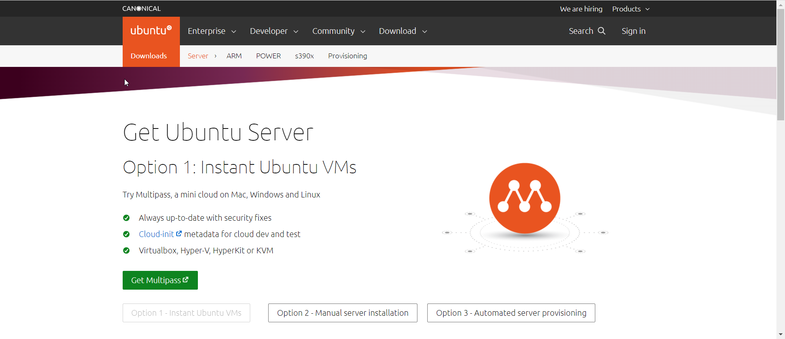

1.4 Create VM1 and install Ubuntu using the instructions [1, chapter 1.8]. Set machine name as "host machine name"_"student last name"

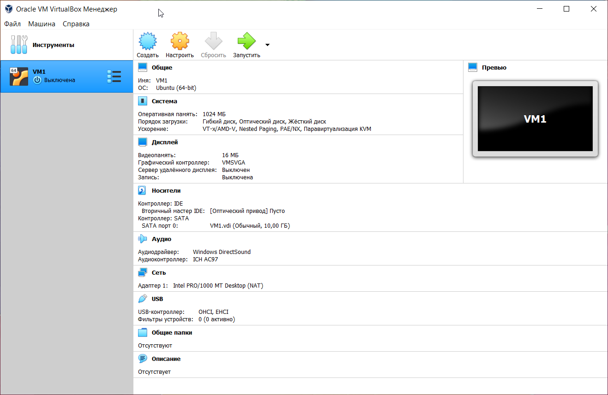
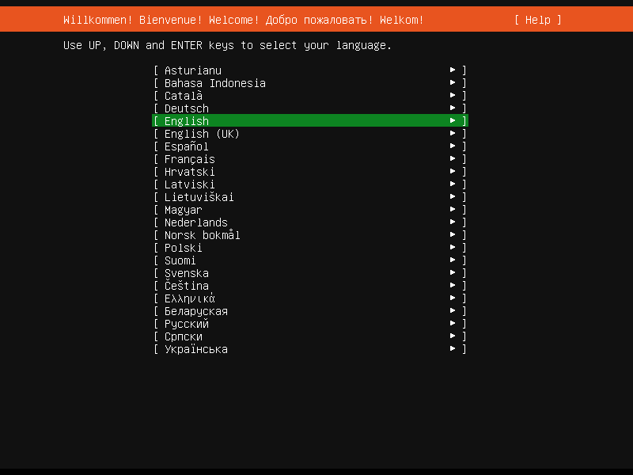
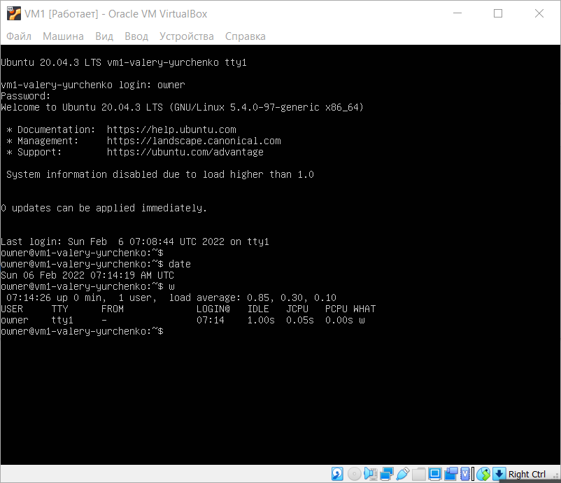

1.5 Get acquainted with the possibilities of VM1 control - start, stop, reboot, save state, use Host key and keyboard shortcuts, mouse capture, etc. [1, ch.1.9].

1.6 Clone an existing VM1 by creating a VM2 [1, ch.1.14].

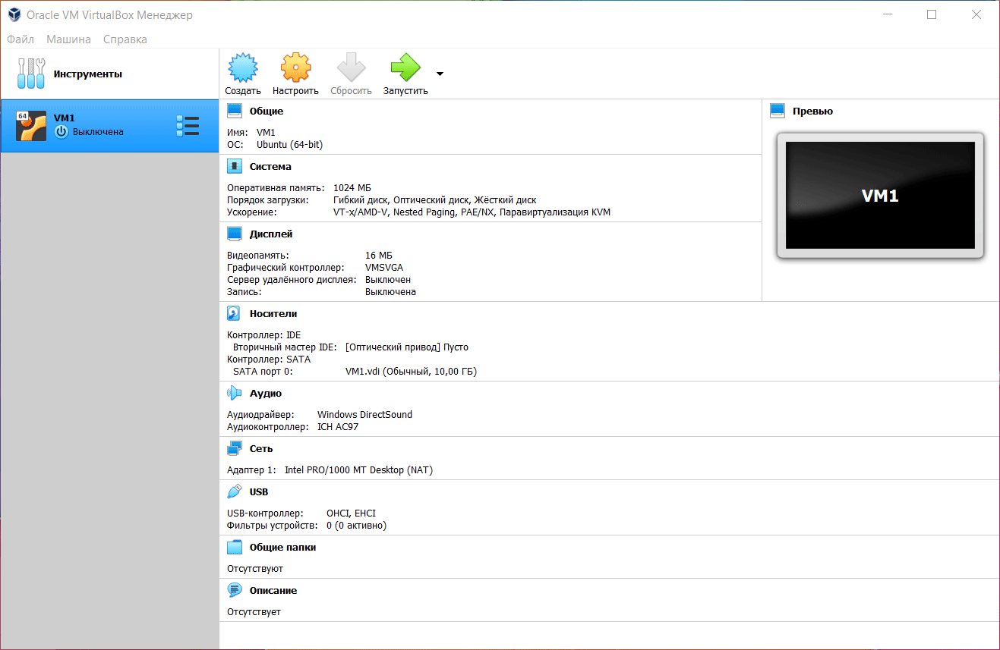

1.7 Create a group of two VM: VM1, VM2 and learn the functions related to groups [1, ch.1.10].

1.8 For VM1, changing its state, take several different snapshots, forming a branched tree of snapshots [1, ch.1.11]

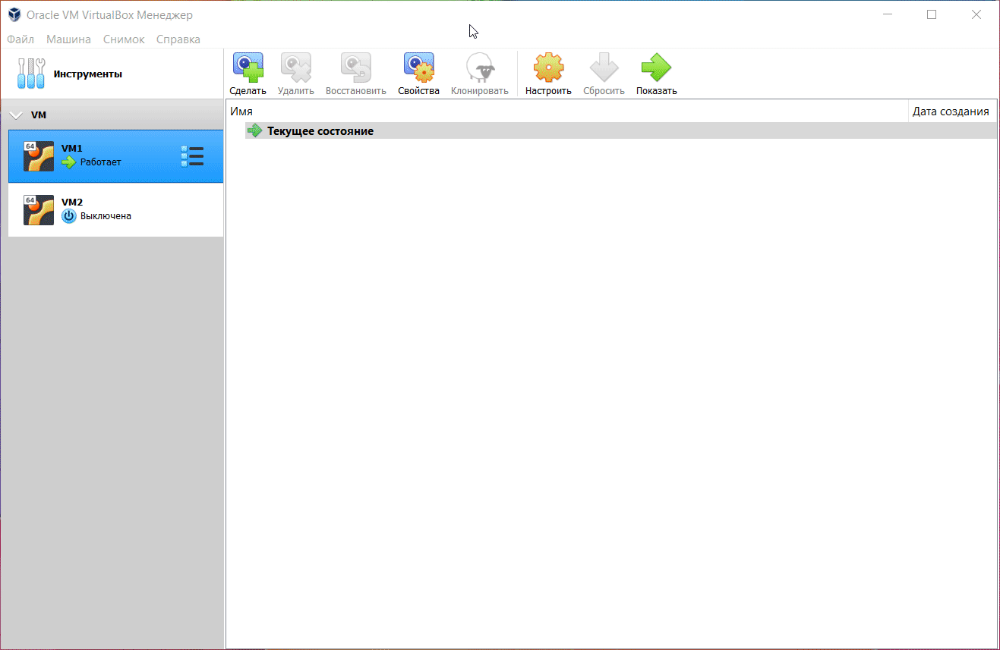

1.9 Export VM1. Save the *.ova file to disk. Import VM from *.ova file [1, ch.1.15].

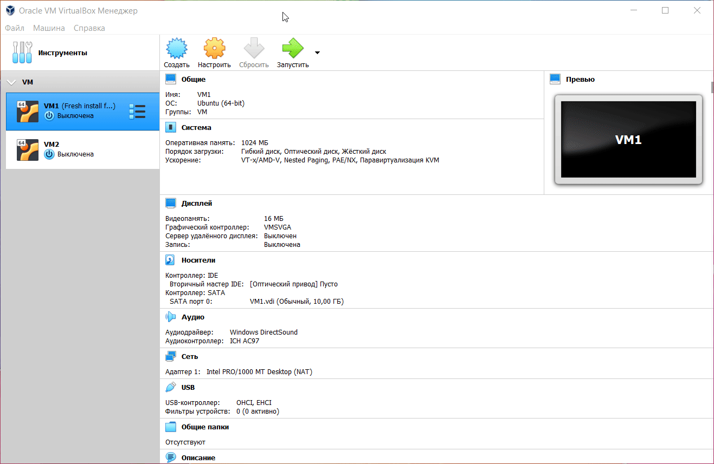
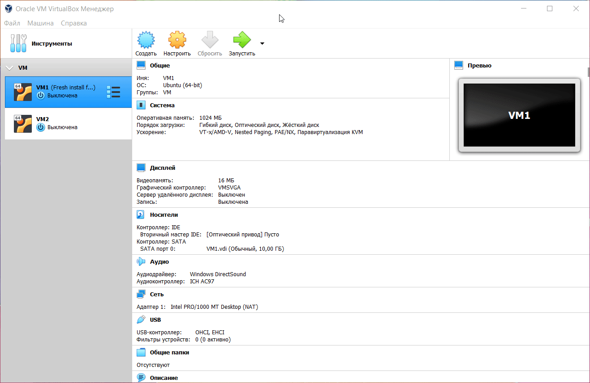
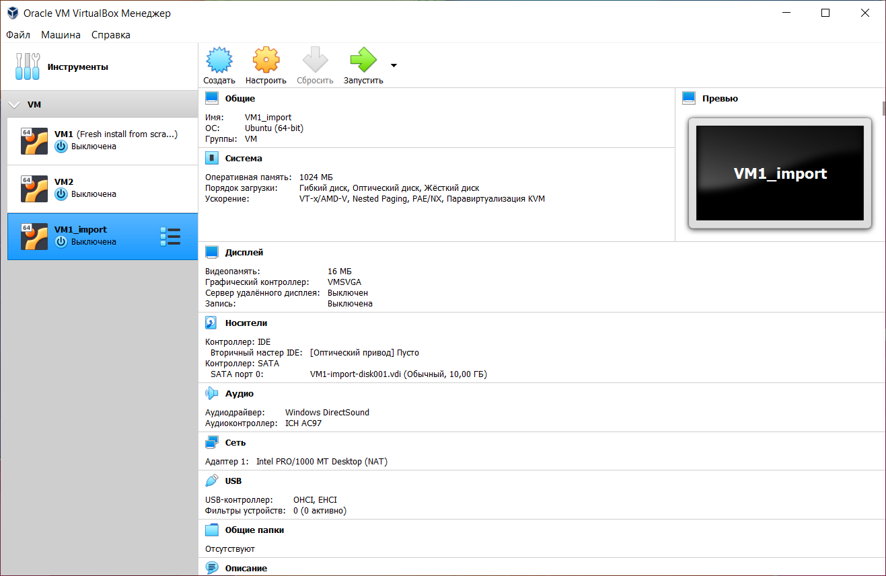

2. Configuration of virtual machines

2.1 Explore VM configuration options (general settings, system settings, display, storage, audio, network, etc.).

2.2 Configure the USB to connect the USB ports of the host machine to the VM [1, ch.3.11].

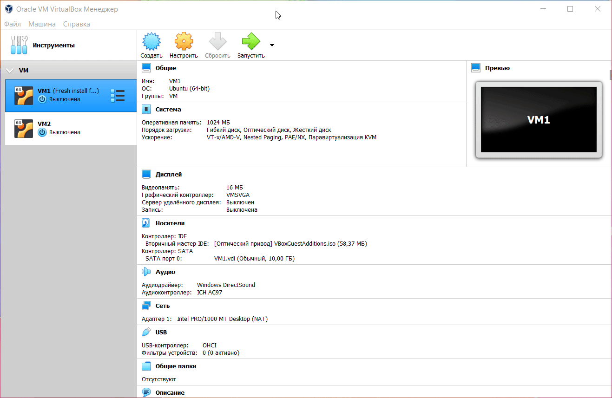

2.3 Configure a shared folder to exchange data between the virtual machine and the host [1, ch.4.3].

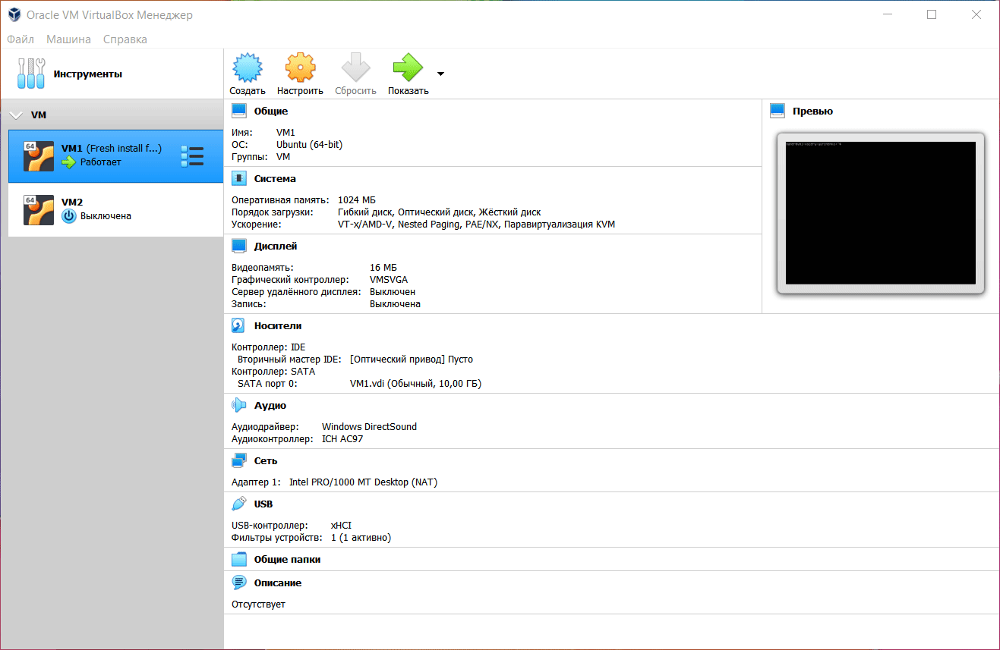

2.4 Configure different network modes for VM1, VM2. Check the connection between VM1, VM2, Host, Internet for different network modes. You can use the ping command to do this. Make a table of possible connections.

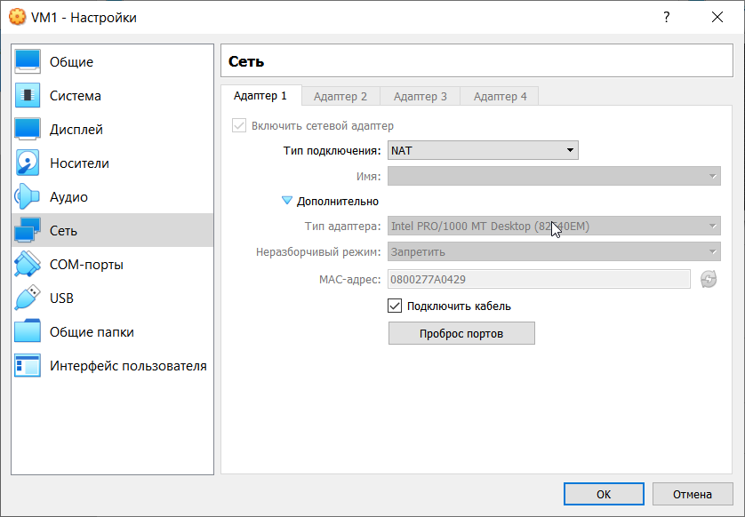

Each of the networking adapters can be separately configured to operate in one of the following modes:

- Not attached. In this mode, Oracle VM VirtualBox reports to the guest that a network card is present, but that there is no connection. This is as if no Ethernet cable was plugged into the card. Using this mode, it is possible to pull the virtual Ethernet cable and disrupt the connection, which can be useful to inform a guest operating system that no network connection is available and enforce a reconfiguration.

- Network Address Translation (NAT). If all you want is to browse the Web, download files, and view email inside the guest, then this default mode should be sufficient for you, and you can skip the rest of this section. Please note that there are certain limitations when using Windows file sharing. See Section 6.3.3, “NAT Limitations”.

- NAT Network. A NAT network is a type of internal network that allows outbound connections. See Section 6.4, “Network Address Translation Service”.

- Bridged networking. This is for more advanced networking needs, such as network simulations and running servers in a guest. When enabled, Oracle VM VirtualBox connects to one of your installed network cards and exchanges network packets directly, circumventing your host operating system's network stack.

- Internal networking. This can be used to create a different kind of software-based network which is visible to selected virtual machines, but not to applications running on the host or to the outside world.

- Host-only networking. This can be used to create a network containing the host and a set of virtual machines, without the need for the host's physical network interface. Instead, a virtual network interface, similar to a loopback interface, is created on the host, providing connectivity among virtual machines and the host.

- Generic networking. Rarely used modes which share the same generic network interface, by allowing the user to select a driver which can be included with Oracle VM VirtualBox or be distributed in an extension pack.

The following sub-modes are available:

+ UDP Tunnel: Used to interconnect virtual machines running on different hosts directly, easily, and transparently, over an existing network infrastructure.

+ VDE (Virtual Distributed Ethernet) networking: Used to connect to a Virtual Distributed Ethernet switch on a Linux or a FreeBSD host. At the moment this option requires compilation of Oracle VM VirtualBox from sources, as the Oracle packages do not include it.

### Table 2.4.1. Overview of Networking Modes

| Mode       | VM→Host | VM←Host    | VM1↔VM2 | VM→Net/LAN | VM←Net/LAN |
| -----------|:-------:|:----------:|:-------:|:----------:|:----------:|
| Host-only  |    +    |    +       |    +    |     -      |    -       |
| Internal   |    -    |    -       |    +    |     -      |    -       |
| Bridged    |    +    |    +       |    +    |     +      |    +       |
| NAT        |    +    |Port forward|    -    |     +      |Port forward|
| NATservice |    +    |Port forward|    +    |     +      |Port forward|

3. Work with CLI through VBoxManage.

3.1 Run the cmd.exe command line.

3.2 Examine the purpose and execute the basic commands of VBoxManage list, showvminfo, createvm, startvm, modifyvm, clonevm, snapshot, controlvm [1, ch.8].

## PART 3. WORK WITH VAGRANT
1. Download the required version of Vagrant according to the instructions [5] and according to the host operating system (OS) installed on the student's workplace. For Windows, the file may be called, for example, vagrant_2.2.0_x86_64.msi. Install Vagrant. Check the path to Vagrant bin in the Path variable (My computer -> Properties -> Advanced system settings -> Advanced -> Environment Variables).

2. Run the powershell. Create a folder "student name" (in English). In this example, create a folder vagrant_test. Next, go to the folder.

3. Initialize the environment with the default Vagrant box: init hashicorp/precise64

4. Run vagrant up and watch for messages during VM boot and startup.

5. Connect to the VM using the program MobaXterm or PuTTY (can be downloaded from [6]), using SSH, IP address and port listed above (127.0.0.1:2222). By default, login - vagrant and password are also vagrant

6. Record the date and time by executing the date command

7. Stop and delete the created VM.

8. Create your own Vagrant box [7] 

9. (optional) Create a test environment from a few servers. Servers' parameters are chosen independently by the student.

# REFERENCES
1. Oracle VM VirtualBox.User Manual https://www.virtualbox.org/manual/
2. Official page VirtualBox https://www.virtualbox.org/
3. Download page Ubuntu https://ubuntu.com/download
4. Documentation page Vagrant https://www.vagrantup.com/docs/index.html
5. Installation instructions page Vagrant https://www.vagrantup.com/docs/installation/index.html
6. Download page PuTTY & MobaXterm https://www.putty.org https://mobaxterm.mobatek.net/
7. O’Reilly - Vagrant: Up and Running.
8. Vagrant Workflows http://czerasz.com/2015/01/06/vagrant-workflows/
9. How To Use Vagrant To Create Small Virtual Test Lab on a Linux / OS X / MS-Windows https://www.cyberciti.biz/cloud-computing/use-vagrant-to-create-small-virtual-lab-on-linux-osx/