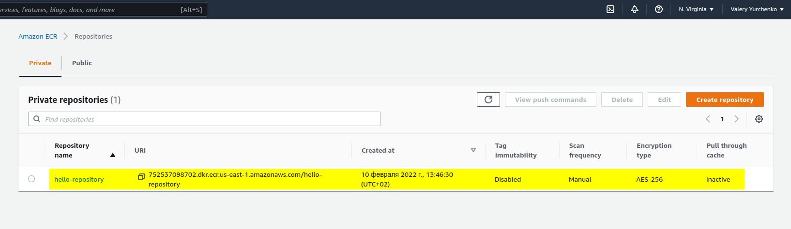

### EPAM University Programs DevOps education program

# Module 2 Virtualization and Cloud Basic

## TASK 2.2

1. Read the terms of Using the [AWS Free Tier](https://docs.aws.amazon.com/en_us/awsaccountbilling/latest/aboutv2/billing-free-tier.html) and the ability to control their own costs.

__Types of offers__

Explore more than 100 products and start building on AWS using the Free Tier. Three different types of free offers are available depending on the product used. Click icon below to explore our offers.

+ __Free Trials__ Short-term free trial offers start from the date you activate a particular service

+ __12 months free__ Enjoy these offers for 12-months following your initial sign-up date to AWS

+ __Always free__ These free tier offers do not expire and are available to all AWS customers

[Learn more about AWS Free Tier](https://aws.amazon.com/ru/free/?all-free-tier.sort-by=item.additionalFields.SortRank&all-free-tier.sort-order=asc&awsf.Free%20Tier%20Types=tier%2312monthsfree%7Ctier%23always-free&awsf.Free%20Tier%20Categories=*all&awsm.page-all-free-tier=1)

__Add ability to control their own costs__:
+ __USER NAME__ ☞ __Billing Dashboard__  ☞ __Billing preferences__ ☞  [✓] __Receive Billing Alerts__

+ __CloudWatch__ ☞ __Alarms__ ☞ __Billing alarms__ ☞ __Create alarm__


2. [Register with AWS](https://portal.aws.amazon.com/billing/signup?redirect_url=https%3A%2F%2Faws.amazon.com%2Fregistration-confirmation#/start) (first priority) or alternatively, you can request access to courses in [AWS Academy](https://aws.amazon.com/ru/training/awsacademy/member-list/) if you are currently a student of [certain University](https://aws.amazon.com/ru/training/awsacademy/member-list/).


3. Find the [hands-on tutorials](https://aws.amazon.com/ru/getting-started/hands-on/?awsf.getting-started-category=category%23compute&awsf.getting-started-content-type=content-type%23hands-on&?e=gs2020&p=gsrc&awsf.getting-started-level=*all) and [AWS Well-Architected Labs](https://www.wellarchitectedlabs.com/) for your AWS needs. Explore list of step-by-step tutorials for deferent category. Use, repeat as many as you can and have fun))

4. Review [Getting Started with Amazon EC2](https://aws.amazon.com/ru/ec2/getting-started/?nc1=h_ls). Log Into Your AWS Account, Launch, Configure, Connect and Terminate Your Instance. Do not use Amazon Lightsail. It is recommended to use the t2 or t3.micro instance and the CentOS operating system.


5. Create a snapshot of your instance to keep as a backup.


6. Create and attach a Disk_D (EBS) to your instance to add more storage space. Create and save some file on Disk_D.


I used the following commands to initially connect the disk to the system:
```
df -hT
sudo lsblk

sudo mkfs -t xfs /dev/xvd
sudo mkdir /mnt/data/
sudo mount /dev/xvvdf /mnt/data/

sudo touch /mnt/data/Hello_Valery_Yurchenko.txt
ls -la /mnt/data/
```

7. Launch the second instance from backup.


8. Detach Disk_D from the 1st instance and attach disk_D to the new instance.


I used the following commands to initially connect the disk to the system:
```
df -hT
sudo lsblk

sudo mkdir /mnt/data/
sudo mount /dev/xvvdf /mnt/data/

ls -la /mnt/data/
```

9. Review the 10-minute [example](https://aws.amazon.com/ru/getting-started/hands-on/get-a-domain/?nc1=h_ls). Explore the possibilities of creating your own domain and domain name for your site. Note, that Route 53 not free service. Alternatively you can free register the domain name *.PP.UA and use it.

10. Launch and configure a WordPress instance with Amazon Lightsail [link](https://aws.amazon.com/ru/getting-started/hands-on/launch-a-wordpress-website/?trk=gs_card)


11. Review the 10-minute [Store and Retrieve a File](https://aws.amazon.com/ru/getting-started/hands-on/backup-files-to-amazon-s3/). Repeat, creating your own repository.


12. Review the 10-minute [example](https://aws.amazon.com/ru/getting-started/hands-on/backup-to-s3-cli/?nc1=h_ls) Batch upload files to the cloud to Amazon S3 using the AWS CLI. Create a user AWS IAM, configure CLI AWS and upload any files to S3.


```
https://s3.amazonaws.com/aws-cli/AWSCLI64.msi

aws configure

AWS Access Key ID [None]: AKIXXXXXXXXXXXXXXXX4
AWS Secret Access Key [None]: ZMIXXXXXXXXXXXXXXXXXXXXXXXXXXh0/k
Default region name [None]: us-east-1
Default output format [None]: json
```
+ To create a new bucket named my-f01-backup-bucket01, enter the following:

```
aws s3 mb s3://my-f01-backup-bucket01
```


+ To download my first __CV_DevOps(6)_Kh_Valery_Yurchenko.pdf__ file located in the local directory (__C:\Users\User\Desktop\DevOPS\EPAM__),
to the S3 bucket __my-f01-backup-bucket01__, you should use the following command:

```
aws s3 cp "C:\Users\User\Desktop\DevOPS\EPAM\CV_DevOps(6)_Kh_Valery_Yurchenko.pdf" s3://my-f01-backup-bucket01/
```


+ To download the my-first-backup.bak file from S3 to a local directory, change the order of the commands as follows:

```
aws s3 cp s3://my-f01-backup-bucket01/CV_DevOps(6)_Kh_Valery_Yurchenko.pdf ./
```


+ To remove the CV_DevOps(6)_Kh_Valery_Yurchenko.pdf file from my-f01-backup-bucket01, use the following command:

```
aws s3 rm s3://my-f01-backup-bucket01/CV_DevOps(6)_Kh_Valery_Yurchenko.pdf
```


13. Review the 10-minute [example](https://docs.aws.amazon.com/AmazonECS/latest/userguide/docker-basics.html) Deploy Docker Containers on Amazon Elastic Container Service (Amazon ECS). Repeat, create a cluster, and run the online demo application or better other application with custom settings.

+ To install Docker on an Amazon EC2 instance:

```
sudo yum update -y
sudo amazon-linux-extras install docker -y
sudo service docker start 
sudo systemctl enable docker
sudo usermod -a -G docker ec2-user
newgrp docker
docker info
```


+ Create a Docker image:

```touch Dockerfile```

```
FROM ubuntu:18.04

# Install dependencies
RUN apt-get update && \
 apt-get -y install apache2

# Install apache and write hello world message
RUN echo 'Hello World!' > /var/www/html/index.html

# Configure apache
RUN echo '. /etc/apache2/envvars' > /root/run_apache.sh && \
 echo 'mkdir -p /var/run/apache2' >> /root/run_apache.sh && \
 echo 'mkdir -p /var/lock/apache2' >> /root/run_apache.sh && \ 
 echo '/usr/sbin/apache2 -D FOREGROUND' >> /root/run_apache.sh && \ 
 chmod 755 /root/run_apache.sh

EXPOSE 80

CMD /root/run_apache.sh
```

```
# Build the Docker image from your Dockerfile.
docker build -t hello-world .

# Run docker images to verify that the image was created correctly.
docker images --filter reference=hello-world

Output:

REPOSITORY          TAG                 IMAGE ID            CREATED             SIZE
hello-world         latest              e9ffedc8c286        4 minutes ago       241MB

# Run the newly built image.
docker run -t -i -p 80:80 hello-world

# You should see a web page with your "Hello World!" statement.
Stop the Docker container by typing Ctrl + c.

```


+ Push your image to Amazon Elastic Container Registry:
```
curl "https://awscli.amazonaws.com/awscli-exe-linux-x86_64.zip" -o "awscliv2.zip"
unzip awscliv2.zip
sudo ./aws/install

aws --version

aws configure
AWS Access Key ID [None]: AXXXXXXXXXXXXXXXXXX4
AWS Secret Access Key [None]: ZXXXXXXXXXXXXXXXXXXXXXXXXXXXXXXXX0/k
Default region name [None]: us-east-1
Default output format [None]: json
```


To tag your image and push it to Amazon ECR:

+ Create an Amazon ECR repository to store your hello-world image. Note the repositoryUri in the output.

```aws ecr create-repository --repository-name hello-repository --region us-east-1```

___Output___:

```
{
    "repository": {
        "repositoryArn": "arn:aws:ecr:us-east-1:752537098702:repository/hello-repository",
        "registryId": "752537098702",
        "repositoryName": "hello-repository",
        "repositoryUri": "752537098702.dkr.ecr.us-east-1.amazonaws.com/hello-repository",
        "createdAt": "2022-02-10T13:46:30+02:00",
        "imageTagMutability": "MUTABLE",
        "imageScanningConfiguration": {
            "scanOnPush": false
        },
        "encryptionConfiguration": {
            "encryptionType": "AES256"
        }
    }
}
```


+ Tag the hello-world image with the repositoryUri value from the previous step.

```docker tag hello-world 752537098702.dkr.ecr.us-east-1.amazonaws.com/hello-repository```

+ Run the aws ecr get-login-password command. Specify the registry URI you want to authenticate to. For more information, see Registry Authentication in the Amazon Elastic Container Registry User Guide.

```aws ecr get-login-password | docker login --username AWS --password-stdin 752537098702.dkr.ecr.us-east-1.amazonaws.com```


+ Push the image to Amazon ECR with the repositoryUri value from the earlier step.

```docker push 752537098702.dkr.ecr.us-east-1.amazonaws.com/hello-repository```




+ __Clean up__ When you are done experimenting with your Amazon ECR image, you can delete the repository so you are not charged for image storage.

```aws ecr delete-repository --repository-name hello-repository --region us-east-1 --force```


14. [Run a Serverless "Hello, World!"](https://aws.amazon.com/ru/getting-started/hands-on/run-serverless-code/?nc1=h_ls) with AWS Lambda.

15. Create a static website on Amazon S3, publicly available ([link1](https://docs.aws.amazon.com/AmazonS3/latest/dev/HostingWebsiteOnS3Setup.html) or [link2](https://docs.aws.amazon.com/AmazonS3/latest/userguide/website-hosting-custom-domain-walkthrough.html) - using a custom domain registered with Route 53). Post on the page your own photo, the name of the educational program (__EPAM DevOps online Winter 2022__), the list of AWS services with which the student worked within the educational program or earlier and the full list with links of completed labs (based on [tutorials](https://aws.amazon.com/ru/getting-started/hands-on/?awsf.getting-started-content-type=content-type%23hands-on&?e=gs2020&p=gsrc&awsf.getting-started-category=*all&awsf.getting-started-level=*all) or[ qwiklabs](https://amazon.qwiklabs.com/)). Provide the link to the website in your report and СV.
