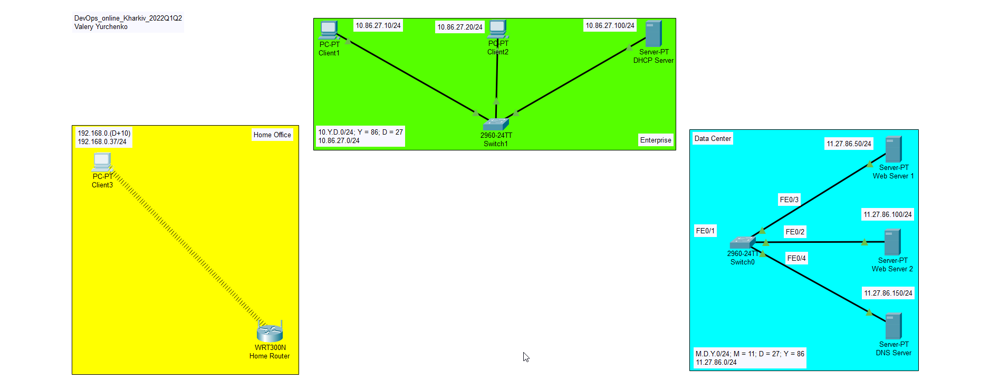
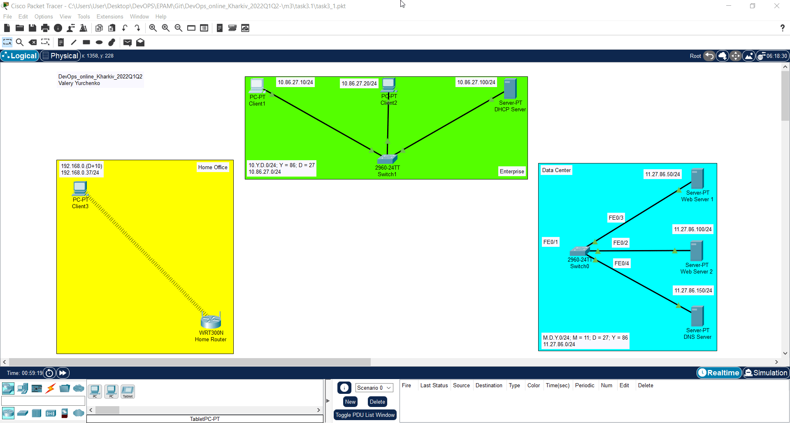
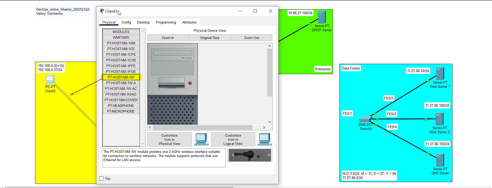
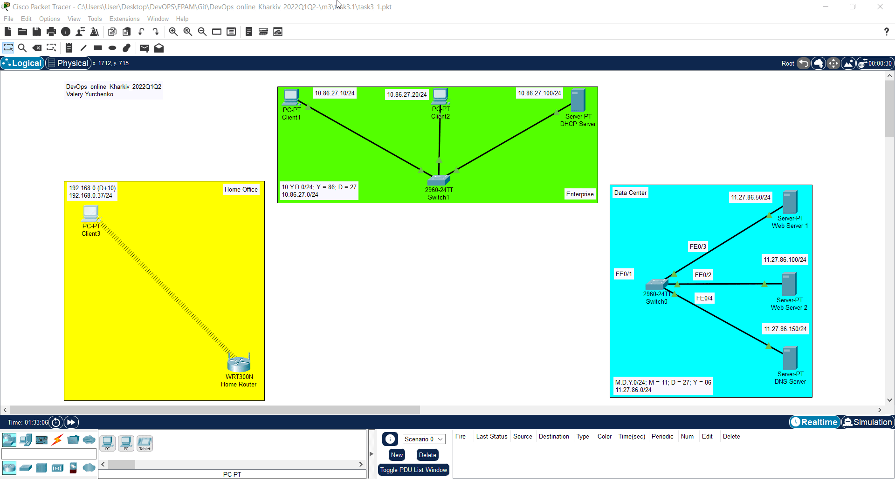
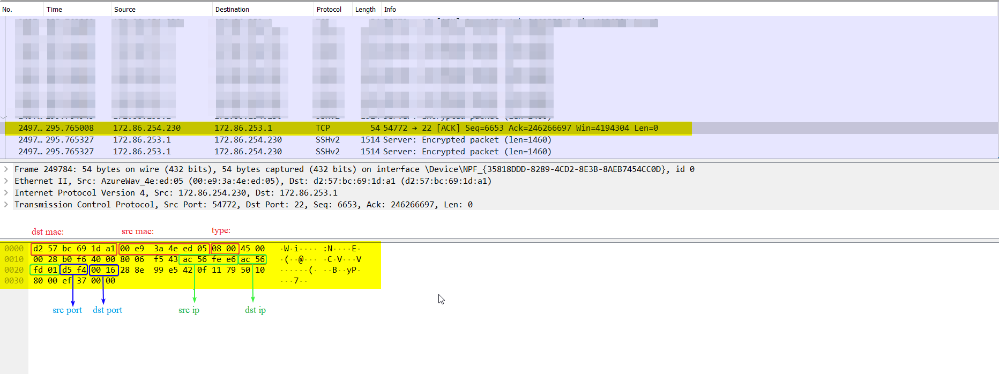

# EPAM University Programs DevOps external course
# Module –Networking Fundamentals

# Task 3.1 - Створення мереж Home Office, Enterprise, Data Center.

1. Створити мережі, як показано на рис. 1. Рекомендовані моделі комутаторів Catalyst 2960, безпровідний маршрутизатор – WRT300N. В мережі Data Center підключити сервери до портів відповідно рис. 1 



2. В мережі Enterprise призначити статичні адреси, сформовані за таким правилом: Адреса мережі 10.Y.D.0/24, де Y – дві останні цифри з вашого року народження, D – дата народження. Хостова частина адреси Client 1 – 10, Client 2 – 20, DHCP Server – 100. Наприклад, якщо ви народились 25-го квітня 1999 р., то адреса мережі буде 10.99.25.0/24, а адреса Client 1- 10.99.25.10/24 


3. Перевірити зв'язок за допомогою команди ping



4. В мережі Data Center призначити статичні адреси, сформовані за таким правилом: M.D.Y.0/24, де М – номер місяця народження, D і Y аналогічно попередньому. Хостова частина Web Server 1 – 50, Web Server 2 – 100, DNS Server – 150. Таким чином адреса DNS Server буде 4.25.99.150 


5. Перевірити зв'язок за допомогою команди ping 


6. На комп’ютері Client 3 замінити мережевий адаптер Ethernet на адаптер Wi-Fi – модуль PT-HOST-NM-1W, як показано на рис. 2. Результатом успішної заміни є поява бездротового зв’язку, як показано на рис. 1



7. Призначити Сlient3 статичну адресу 192.168.0.(D+10). Для нашого прикладу це буде 192.168.0.35. 


8. Перевірити зв'язок з маршрутизатором за допомогою команди ping 192.168.0.1



9. Додаткове завдання: Дослідження структури пакету за допомогою аналізатора пакетів Wireshark.



```
MAC-адреса відправника: 00:e9:3a:4e:ed:05
MAC-адреса отримувача: d2:57:bc:69:1d:a1
IP-адреса відправника: 172.86.254.230
IP-адреса отримувача: 172.86.253.1
TCP-порт відправника: 54772
TCP-порт отримувача: 22
```
