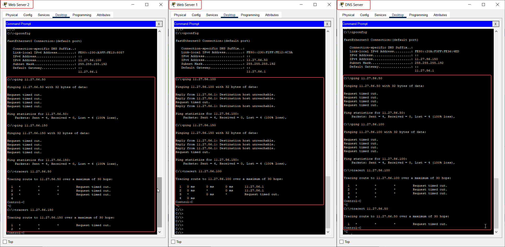
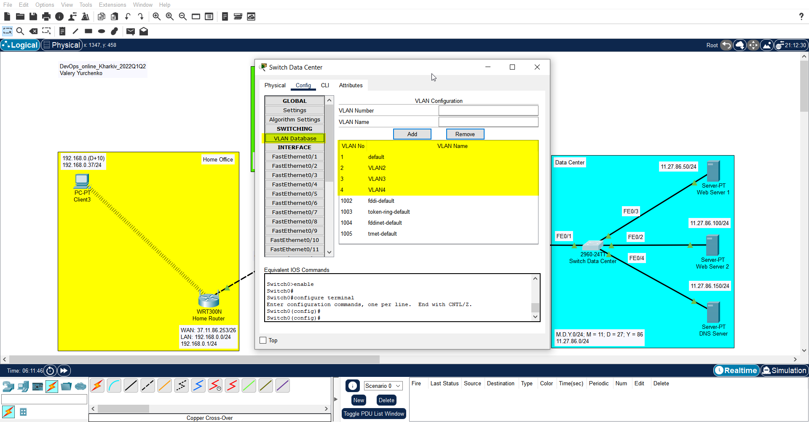

##### EPAM University Programs DevOps external course. Module –Networking Fundamentals

# Task 3.2 - Створення мереж Home Office, Enterprise, Data Center.

1. З’єднати створені у попередньому Taskу мережі між собою, як показано на рис. 1. Для побудови мережі Internet використати маршрутизатори PT-Empty, попередньо вставивши в них 5 модулів 1CGE, як показано на рис. 2. Switch мережі Enterprise підключити до інтерфейсу GigabitEthernet0/0 (GE0/0) Router ISP1, Switch мережі Data Center підключити до інтерфейсу GigabitEthernet0/0 (GE0/0) Router ISP3, WAN порт Home Router мережі Home Office підключити до інтерфейсу GigabitEthernet0/0 (GE0/0), як показано на рис.1. Маршрутизатори з’єднати між собою через інтерфейси, як показано на рис. 1.


Рис. 1 


Рис. 2

2. Для реалізації мережі Internet використати мережу з адресою (D+10).M.Y.0/24, поділивши її на підмережі з префіксом /26.


3. Призначити ІР-адреси інтерфейсам маршрутизаторів за такими правилами: Router ISP1 GE0/0 - 10.Y.D.1/24, Router ISP3 GE0/0 - M.D.Y.1/24. Адреси для решти інтерфейсів маршрутизаторів призначити відповідно до поділу адреси (D+10).M.Y.0/24 на підмережі. Приклад призначення IP адреси інтерфейсу маршрутизатора ISP1 GE0/0 показано на рис. 3. Увага – обов’язково слід увімкнути інтерфейс поставивши позначку в полі «On»


4. На комп’ютерах вказати адреси відповідні адреси шлюзів (Default Gateway) 


5. Перевірити зв'язок комп’ютерів з власними шлюзами за допомогою команди ping


## Налаштування VLAN в Data Center 

6. Перевірити зв’язок між серверами за допомогою команди ping та маршрут проходження пакета за допомогою tracert 


7. Змінити маску підмережі на серверах на 255.255.255.192 


8. Повторити пункт 6 та зафіксувати і пояснити зміни 



Как мы видим, ```ping``` и ```traceroute``` прошли успешно на 11.27.86.1 (маршрутизатор), но безуспешно на конечных устройствах. Эта беда сохраняется, т.к. в сети с маской 26 всего 62 хоста, а у наших серверов адреса 50, 100 и 150. 100 и 150 - за пределами сети.

9. Змінити приналежність портів Switch Data Center VLAN таким чином: FE0/2 – VLAN2, FE0/3 – VLAN3, FE0/4 – VLAN4. Для цього на Switch Data Center створити відповідні додаткові VLAN, як показано на рис.4, та увести відповідні порти до відповідних VLAN, як показано на рис. 5.




10. Повторити пункт 6 та зафіксувати і пояснити зміни 


Как видим, ```Ping``` и ```Traceroute``` не работают, так как теперь устройства находяться в других виртуальных сетях и не настроен транковый порт в роутере ISP3.

11. Для тих, хто буде робити додаткове завдання, перейти до пункту 12, в іншому випадку необхідно повернути порти FE0/2, FE0/3, та FE0/4 до VLAN1. Також бажано відновити маску підмережі на серверах до 255.255.255.0 Рис.5


## Налаштування маршрутизації між VLAN (додаткове завдання)

12. Для налаштування маршрутизації між VLAN необхідно перевести порт FE0/1 Data Center switch в режим trunk, як показано на рис.6


Рис.6

13. Увага! Наступні налаштування необхідно виконувати на маршрутизаторі Router ISP3 в режимі CLI. Перш ніж виконувати наступні кроки необхідно видалити на інтерфейсі Router ISP3 GE0/0 IP-адресу, як показано на рис. 7.


14. Перейти в режим CLI на маршрутизаторі, створити три subinterface і налаштувати їх, як показано нижче. В ІР-адресах замість перших трьох одиниць поставити M.D.Y

```
Router(config-if)# interface GigabitEthernet0/0.2
Router(config-subif)# encapsulation dot1Q 2
Router(config-subif)# ip address 11.27.86.1 255.255.255.192

Router(config-if)# interface GigabitEthernet0/0.3
Router(config-subif)# encapsulation dot1Q 3
Router(config-subif)# ip address 11.27.86.65 255.255.255.192

Router(config-if)# interface GigabitEthernet0/0.4
Router(config-subif)# encapsulation dot1Q 4
Router(config-subif)# ip address 11.27.86.129 255.255.255.192
```


15. На Web Server1, Web Server2 та DNS Server вказати шлюзами адреси M.D.Y.1, M.D.Y.65 та M.D.Y.129 відповідно


16. Перевірити працездатність за допомогою команди ping з одного сервера на інший.


