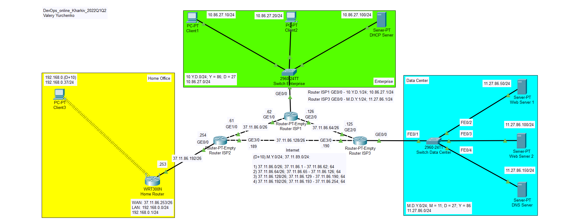
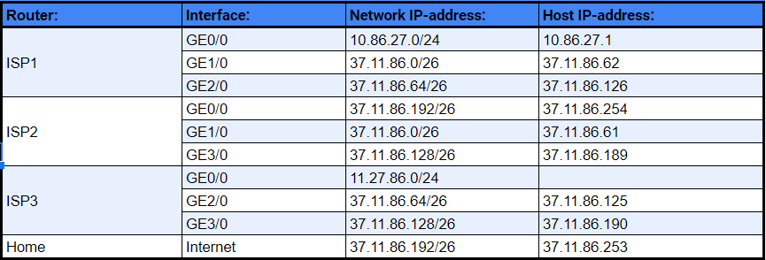
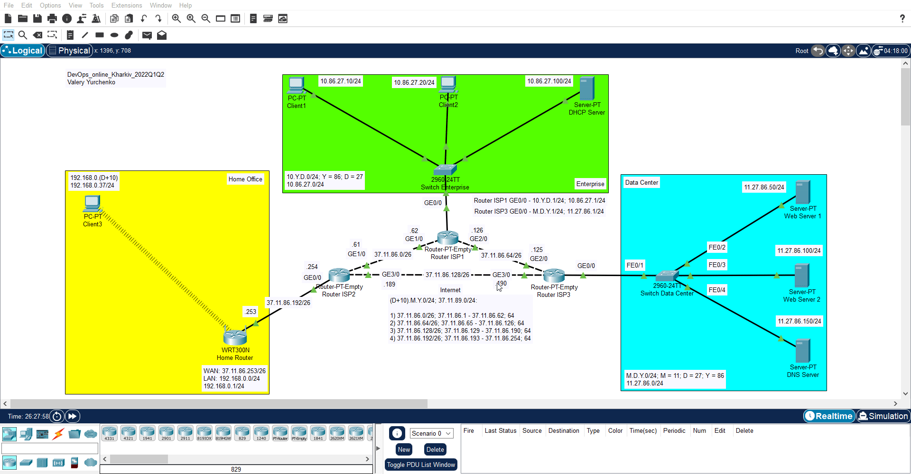
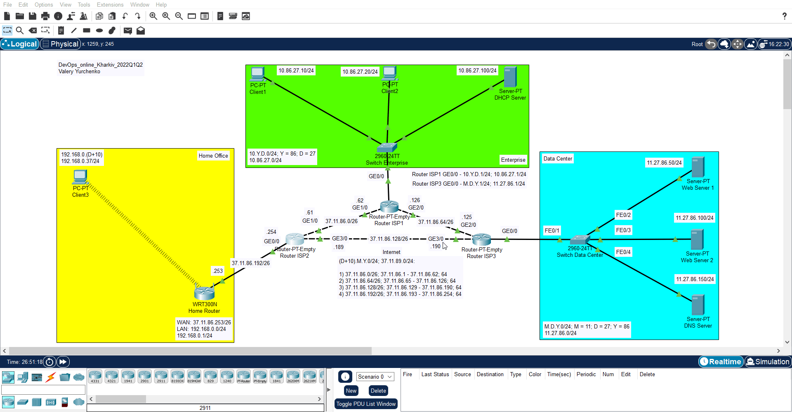

##### EPAM University Programs DevOps external course. Module –Networking Fundamentals

# Task 3.3 – Налаштування маршрутизації

Нехай в результаті поділу магістральної мережі (Рис.1) на підмережі були призначені адреси інтерфейсам маршрутизаторів, як показано в таблиці 1.

Рис.1 

Таблиця 1.

1. Налаштувати таблиці маршрутизації на маршрутизаторах ISP1, ISP2 та ISP3. В таблиці маршрутизації слід вносити тільки віддалені мережі. Наприклад, на Router ISP2 необхідно вказати маршрути тільки до мереж 10.86.27.0/24 та 11.27.86.0/24. Мережу 192.168.0.0 в таблиці маршрутизаторів ISP1, ISP2 та ISP3 заносити нетреба, оскільки вона знаходиться під NAT. Приклад налаштування маршрутизації на Router ISP2 наведено на рис. 2.

Рис. 2 

2. Налаштувати маршрутизацію на бездротовому маршрутизаторі Home Router, для чого додати Default маршрут на Router ISP2, як показано на рис. 3

Рис.3 

3. Перевірити працездатність мережі за допомогою команди ping та tracert. Остання команда дозволить проконтролювати маршрут пакету. На рис.4 наведено результати tracert з Client 1 на Web Server 2.

Рис. 4 

## Налаштування динамічної маршрутизації (додаткове завдання) 

4. З таблиць маршрутизації маршрутизаторів ISP1, ISP2 та ISP3 видалити статичні записи.

5. На маршрутизаторах ISP1, ISP2 та ISP3 налаштувати протокол RIP, для чого вказати перелік безпосередньо приєднаних мереж у класовому форматі, як показано на рис.5 для ISP1.

Рис. 5 

6. Для перевірки працездатності повторити пункт 3.

