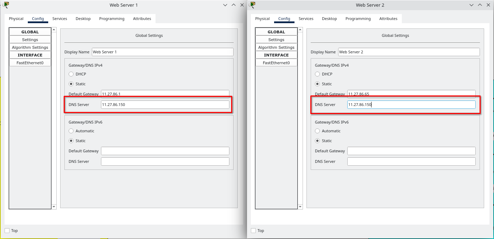

##### EPAM University Programs DevOps external course. Module –Networking Fundamentals

# Task 3.4 – Налаштування DHCP, DNS, NAT

1. Налаштувати DHCP Server в Enterprise мережі (рис.1). Для цього увійти в
налаштування DHCP Server


Рис.1

2. Зробити налаштування DHCP Pool, вказавши початкову адресу 10.Y.D.10 та
адресу Default Gateway – адресу інтерфейсу GE0/0 Router ISP1. Зберегти
налаштування (кнопка Save) та увімкнути DHCP сервіс (позначка On) на рис.2


Рис. 2

3. Перевірити працездатність сервісу, поставивши в налаштуваннях Client 1 та
Client 2 DHCP, як показано на рис. 3


Рис. 3

4. Налаштувати DHCP на Home Router та перевірити працездатність на Client 3


5. Для налаштування і перевірки роботи DNS сервісу призначити Web Server1 та
Web Server2 доменні імена, наприклад, ```domain1.com``` та ```domain2.com```
відповідно.



6. Внести відповідні записи в налаштування DNS сервера, як показано на рис. 4
та увімкнути DNS service.


Рис. 4

7. Додати до налаштувань DHCP серверів адресу DNS сервера та оновити
налаштування на клієнтах (переключившись з DHCP в Static і назад в DHCP).


8. Перевірити працездатність шляхом відправки ```ping``` з Client на доменне ім’я, як
показано на рис. 5


Рис. 5

## Налаштування Port Forwarding на Home Router (додаткове завдання)

9. Додати в мережу Home Office Home Server та призначити йому статичну
адресу, як показано на рис. 6


Рис.6

10. На Home Server для HTTP сервісу відкоригувати index.html, як показано на
рис. 7


Рис. 7

11. Налаштувати Port Forwarding на Home Router, як показано на рис. 8


Рис. 8

12. Додати на DNS Server запис для Home Server, як показано на рис.9


Рис.9

13. Перевірити працездатність шляхом уведення на Client1 у Desktop/Web
Browser - domain3.com, як показано на рис. 10


Рис. 10