##### EPAM University Programs DevOps external course. Module – 4 Linux Essentials

# Task 4.1 - Module – 4 Linux Essentials.

# Task1.Part1 

1) Log in to the system as root (or sudo-er).


```su -```

2) Use the passwd command to change the password. Examine the basic parameters of the command. What system file does it change *?


```/etc/passwd```

3) Determine the users registered in the system, as well as what commands they execute. What additional information can be gleaned from the command execution?

```who```, ```w```, ```last -a```, ```lastlog```


4) Change personal information about yourself.

```sudo chfn owner```, ```sudo chsh owner```, ```sudo usermod -c "Valery Yurchenko" owner```, ```sudo finger -lmps owner```


5) Become familiar with the Linux help system and the man and info commands. Get help on the previously discussed commands, define and describe any two keys for these commands. Give examples.

```w```, ```w --help```

We can use  ```w -hsf``` to display the result of w command without the header and in short format:

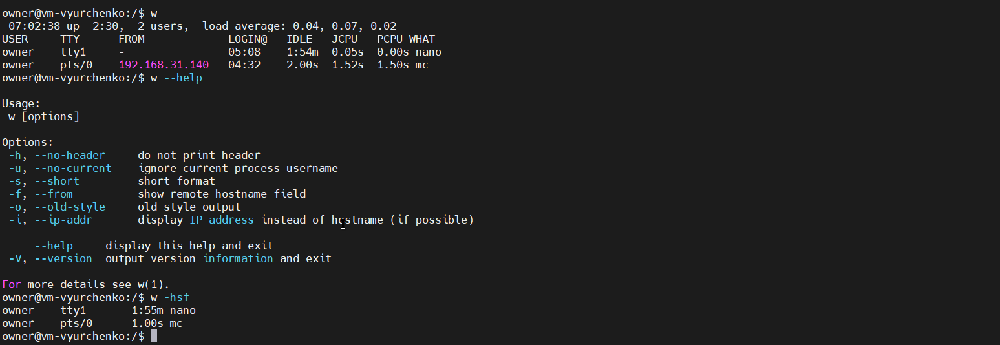

```man w | less```


6) Explore the ```more``` and ```less``` commands using the help system. View the contents of files .bash* using commands.

```more``` is one of the oldest terminal pagers in the UNIX ecosystem. Originally, ```more``` could only scroll down, but now we can use it to scroll up one screen-full at a time, and scroll down either one line or one screen-full. On its status bar, more shows the percentage of the file read. It automatically closes when it reaches the end of the file without having to press a button.

```more``` has many interactive commands like:

- ```space``` – to go to the next page in accordance with the terminal’s size
- ```b``` – to go back one page
- ```enter``` – to scroll down one line
- ```=``` – to display the current line number
- ```:v``` – to start up the vi text editor at the current line

One of to the reasons why ```less``` was introduced was to allow backward movement line by line. It has a lot of commands that are similar to the vi text editor’s commands, and it - supports horizontal scrolling, live monitoring, and more.

```more ~/.bashrc```


```less ~/.bashrc```

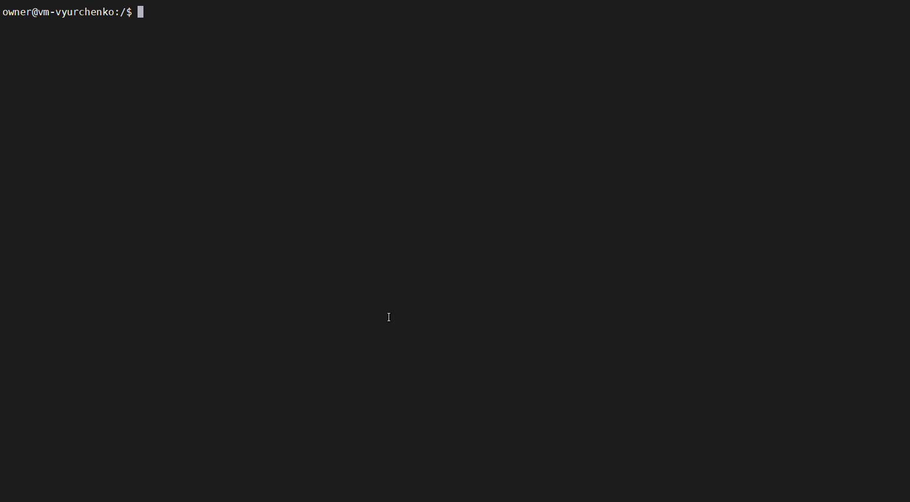

7) * Describe in plans that you are working on laboratory work 1. Tip: You should read the documentation for the finger command.

What is finger?
finger command is used to lookup information about an user.

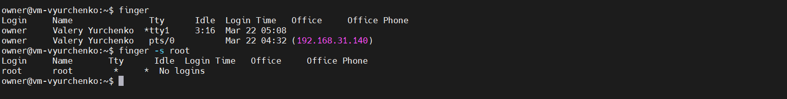

```finger``` - View detail about a particular user 
finger command will display login, username, home directory, shell information about a particular user as shown below.

```finger owner``` - View login details and Idle status about an user
You can use finger -s option to view the login detail for a particular user.

Syntax and Options:

```-s``` Display the user’s login name, real name, terminal name and write status idle time, login time, and either
office location and office phone number, or the remote host.

```-p``` Prevent the ```-l``` option of finger from displaying the contents of the .forward, .plan, .project and .pubkey
files.

```-m``` Prevent matching of user names. User is usually a login name; however, matching will also be done on the users’
real names, unless the -m option is supplied.Display the user’s login name, real name, terminal name and write

status idle time, login time, and either office location and office phone number, or the remote host.

```-o``` When used in conjunction with the -s option, the office location and office phone information is displayed
instead of the name of the remote host.

8) * List the contents of the home directory using the ls command, define its files and directories. Hint: Use the help system to familiarize yourself with the ls command.

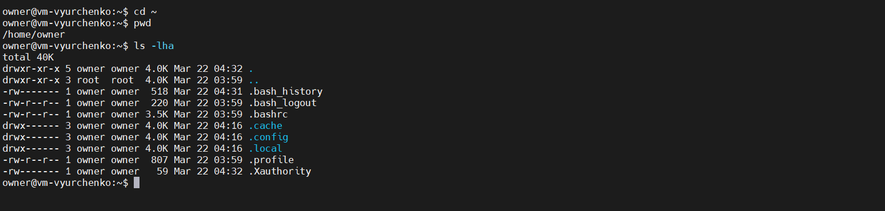

Useful options for the ```ls```:

• ```ls -a``` - List all files, including hidden files beginning with a period.

• ```ls -ld *``` - List details about a directory and not its contents.

• ```ls -F``` - Put an indicator character at the end of each name.

• ```ls -l``` - Simple long listing.

• ```ls -lR``` - Recursive long listing.

• ```ls -lh``` - Give human readable file sizes.

• ```ls -lS``` - Sort files by file size.

• ```ls -lt``` - Sort files by modification time (very useful!).


# Task1.Part2

1) Examine the tree command. Master the technique of applying a template, for example, display all files that contain a character c, or files that contain a specific sequence of characters. List subdirectories of the root directory up to and including the second nesting level.

Tree is a tiny program used to recursively list the content of a directory in a tree-like format:

```
sudo tree -f -P 'ho*ts' --prune /

sudo tree -L 2 / | less
```


The tree command has many options. Here are those that are responsible for displaying the folder tree:

```
-a - output all files without exception.

-d - just a list of directories.

-l - follow symbolic links that lead to folders.

-f - the contents of the folders will be shown with path prefixes.

-x - considers only the current file system.

-L - sets the nesting level to display in the output.

-R - recursively go through the directories of all levels.

-P - display files whose name matches the pattern.

-I - exclusion from the output of files whose name matches the pattern.

-o - print the output to a file with the given name.
--noreport Prevents the command from reporting the number of folders and files at the end of the tree.

--charset - sets encodings for displaying graphic and html files.

--filelimit - folders that contain more files than specified will not be shown.
```

And these options are used to control the display of document titles:

```
-q - replaces non-printable characters in filenames with ?.

-N Displays non-printable characters in filenames as is.

-Q encloses filenames in double quotes.

-p - for each file, specifies its name and a list of allowed actions.

-u Prints the name or ID of the account under which the file was created.

-g Prints the name or ID of the user group that has permissions to access the file.

-s - next to the file name displays its size in bytes.

-h - displays the file size in a form that is easier for human perception, adding a letter abbreviation to the number.

-D prints the date the file was last modified (or the last status change in combination with the -c option).

-F - adds / for folders, = for socket files, * for executable files, > for door files, | for special FIFO files.

--inodes Displays the inode numbers for files and folders.

--device Specifies the device number to which the file or folder belongs.
```

Options for sorting results:

```
-v - sorts output by nesting levels.

-t Sorts the output by the date the files and folders were last modified.

-c - sorts the output by the date the status was last changed.

-U will output the results in the order in which the folders are located on the disk.

-r sorts output in reverse order.
--dirsfirst - folders will be shown first, then files.
```

Tree display options:

```
-i - removes lines ("branches" of the tree), files and folders are displayed as a list.

-n - makes the tree one-color.

-C - Returns a multi-colored display to the tree after using the -n option.
```

2) What command can be used to determine the type of file (for example, text or binary)? Give an example.

```
sudo file /bin/tar

sudo file /etc/passwd
```

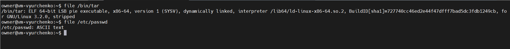

3) Master the skills of navigating the file system using 
relative and absolute paths. How can you go back to your home directory from anywhere in the filesystem?

We can use ```cd ~```, ```cd $HOME``` command to go back to your home directory from anywhere:

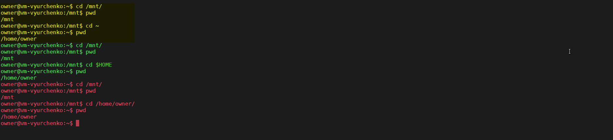

4) Become familiar with the various options for the ls command. Give examples of listing directories using different keys. Explain the information displayed on the terminal using the -l and -a switches.

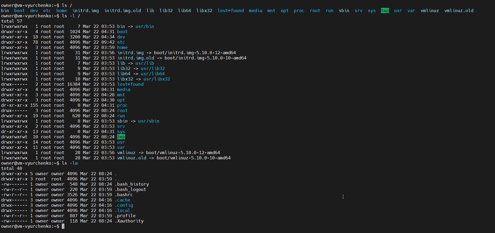

```-l``` displays detailed information about the files.

```-a``` shows hidden files.

The ```ls -l``` (```ls -la```) command displays the following information:

```
file permissions (-rwxrw-r--),
number of (hard) links (1),
owner name (owner),
owner group (owner),
file size in bytes (2048),
time of last modification (Mar 22 09:42),
file/directory name.
```

5) Perform the following sequence of operations:
- create a subdirectory in the home directory;
- in this subdirectory create a file containing information about directories located in the root directory (using I/O redirection operations);
- view the created file;
- copy the created file to your home directory using relative and absolute addressing.
- delete the previously created subdirectory with the file requesting removal;
- delete the file copied to the home directory.

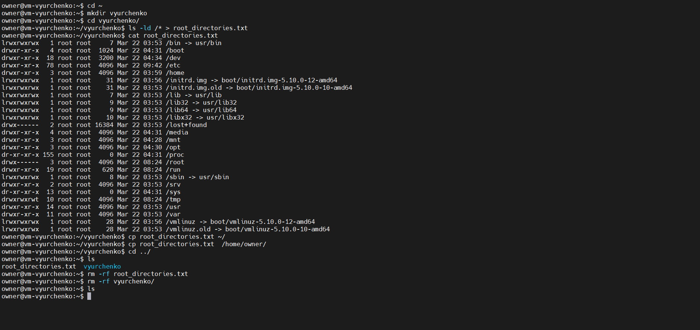

6) Perform the following sequence of operations:
- create a subdirectory test in the home directory;
- copy the .bash_history file to this directory while changing its name to labwork2;
- create a hard and soft link to the labwork2 file in the test subdirectory;

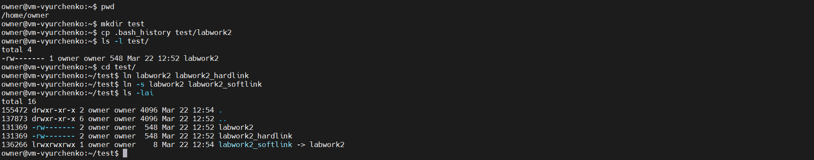

- how to define soft and hard link, what do these concepts;

A symbolic or soft link is an actual link to the original file, whereas a hard link is a mirror copy of the original file.

```
 If we delete the original file, the soft link has no value, because it points to a non-existent file. 

 If we delete the original file, the hard link will still has the data of the original file. 
```

- change the data by opening a symbolic link. What changes will happen and why

We can see that the labwork2 file also was modified. It happened because we had modified the file's link.

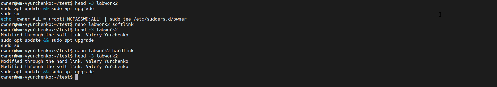

- rename the hard link file to hard_lnk_labwork2;
- rename the soft link file to symb_lnk_labwork2 file;
- then delete the labwork2. What changes have occurred and why?

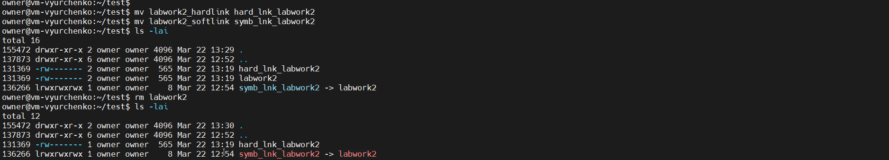

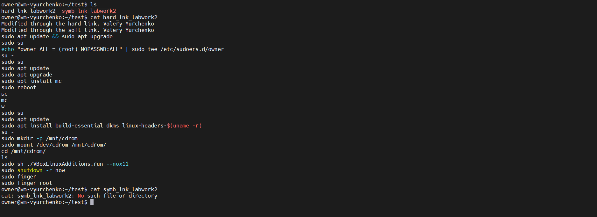

We still can access the file through the hard link. But the file isn't available through the soft link.

7) Using the locate utility, find all files that contain the squid and traceroute sequence.

```
sudo apt update 
sudo apt install mlocate

sudo updatedb
```

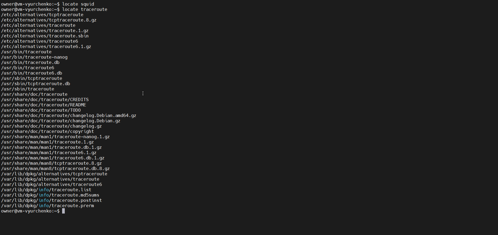

8) Determine which partitions are mounted in the system, as well as the types of these partitions.

9) Count the number of lines containing a given sequence of characters in a given file.

10) Using the find command, find all files in the /etc directory containing the host character sequence.

11) List all objects in /etc that contain the ss character sequence. How can I duplicate a similar command using a bunch of grep?

12) Organize a screen-by-screen print of the contents of the /etc directory. Hint: You must use stream redirection operations.

13) What are the types of devices and how to determine the type of device? Give examples.

14) How to determine the type of file in the system, what types of files are there?

15) * List the first 5 directory files that were recently accessed in the /etc directory.
