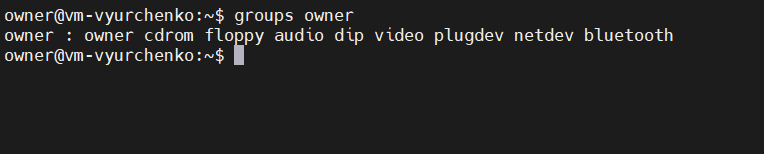
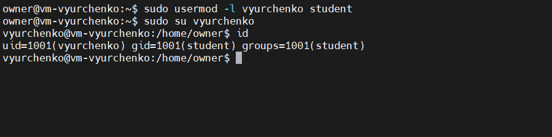

##### EPAM University Programs DevOps external course. Module – 4 Linux Essentials

# Task 4.2 - Module – 4 Linux Essentials.

# Task2.Part1 

Task assignment.

1) Analyze the structure of the /etc/passwd and /etc/group file, what fields are present in it, what users exist on the system? Specify several pseudo-users, how to define them?


The ```"/etc/passwd"``` file contains information about the users on the system. Each line describes a distinct user. Each line has the next structure:

```username:password:UID(user_id):GID(group_id):user_id_info(a comment field):home_directory:command/shell```

The ```"/etc/group"``` file applies to the general security scheme for Unix-like systems: user, group, and file access.

```group_name:password:group_id:list```

These two files contain information about both real and pseudo-users. The most common pseudo-users:

+ daemon (used by system service processes)
+ bin (gives ownership of executables command)
+ adm (owns registration files)
+ nobody (used by many services)
+ sshd (used by the secure shell server)

 Pseudo-users have UID range from 1 to 999. Also, we can + identify pseudo-users by looking at the last field of the line. It typically contains ```"/usr/sbin/nologin"``` or ```"/bin/false"```. When real users often have access to a shell (```"/bin/bash"```).

2-3) What are the uid ranges? What is UID? How to define it?
What is GID? How to define it?

```id -u```, ```id -g```, ```cat /etc/passwd | grep owner```


Unix-like operating systems identify a user by a user identifier (UID). The UID, along with the group identifier (GID) and other access control criteria, is used to determine which system resources a user can access.

Available UIDs are usually splitted into two ranges:

+ 1-999 – for system users (pseudo-users). These are users that do not map to actual “human” users, but are used as security identities for system daemons, to implement privilege separation and run system daemons with minimal privileges.

+ 1000-65533 and 65536-4294967294 – for everything else, including regular users.

+ The root user has the UID of 0.

+ We can determine UID and GID by looking at the "/etc/passwd" file.

4) How to determine belonging of user to the specific group?

```groups owner```



5) What are the commands for adding a user to the system? What are the basic parameters required to create a user?

We can add a new user by the following command: ```useradd [-c uid comment] [-d dir] [-e expire] [-f inactive] [-g gid] [-m [-k skel_dir]] [-s shell] [-u uid [-o]] username```

```sudo adduser student```


6) How do I change the name (account name) of an existing user?

```usermod -l [new_username] [username]```, ```sudo usermod -l vyurchenko student```



7) What is skell_dir? What is its structure?

skel_dir is a directory containing files that will be automatically copied to the new user's home directory.

When creating a new user, this option is only valid if the -m (or --create-home) option is specified. If this option is not set, the skeleton directory is defined by the SKEL variable in ```/etc/default/useradd``` or, by default, ```/etc/skel```.

8) How to remove a user from the system (including his mailbox)?

```userdel -r [username]```

9) What commands and keys should be used to lock and unlock a user account?

To lock a users account we can use the command ```usermod -L``` or ```passwd -l```. ```usermod --lock``` user or # ```passwd --lock user```

```usermod --lock [user]```, ```usermod --unlock [user]```, ``` passwd --status [user]```


10) How to remove a user's password and provide him with a password-free login for subsequent password change?

```passwd -d [username]```


11) Display the extended format of information about the directory, tell about the information columns displayed on the terminal.


+ First column - Access rights
+ The second column - the permissions.
+ The second column shows the number of hard-links for the inode*.
+ The third column shows the user.
+ The fourth column shows the group.
+ The fifth column shows the size of the file.
+ The sixth column shows the date of the last change.
+ The last column shows the name of the file.

*inode is a file system object containing information about the owner / group that owns a file or directory, access rights, its size, file type, timestamps reflecting the inode modification time (ctime, changing time), content modification time file (mtime, modification time) and the time of the last access to the file (atime, access time) and a counter for counting the number of hard links to the file.

12) What access rights exist and for whom (i. e., describe the main roles)? Briefly describe the acronym for access rights.

13) What is the sequence of defining the relationship between the file and the user?

14) What commands are used to change the owner of a file (directory), as well as the mode of access to the file? Give examples, demonstrate on the terminal.

15) What is an example of octal representation of access rights? Describe the umask command.

16) Give definitions of sticky bits and mechanism of identifier substitution. Give an example of files and directories with these attributes.

17) What file attributes should be present in the command script?