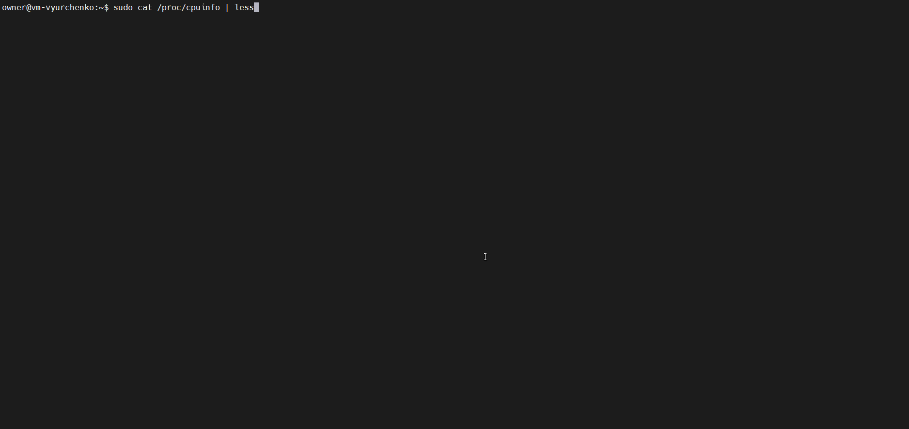
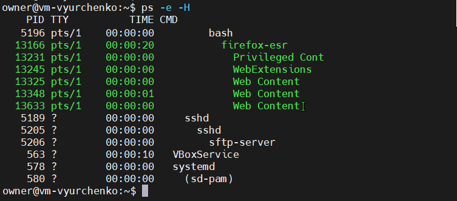
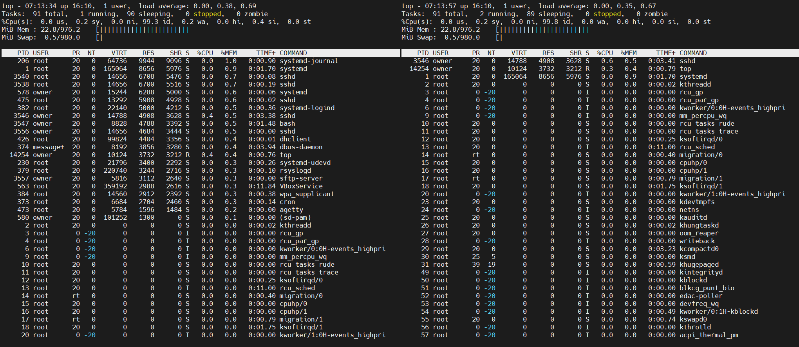

##### EPAM University Programs DevOps external course. Module – 4 Linux Essentials

# Task 4.3 - Module – 4 Linux Essentials.

Task assignment.

Part1
1. How many states could has a process in Linux?

A Linux process has 5 states:
+ created;
+ ready;
+ waiting;
+ running;
+ terminated.

2. Examine the pstree command. Make output (highlight) the chain (ancestors) of the current process.

__installation__

The pstree program is usually included in the standard installation, but can otherwise be obtained via the package ```sudo apt install psmisc```

__syntax__

pstree is called in a terminal with the following command:

```pstree OPTIONS```

__options__

The pstree command has the following options:

```
-a Displays the command line arguments used to invoke the appropriate process.

-c Identical subtrees are not merged, i.e. turn off the default compact output.

-l Does not create a line break for "long" lines (> 132 characters), but displays them completely.

-h Highlight the current process and its ancestors in bold.

-p Displays the process identification number PID of the respective process in addition to the process name.

-n Output is sorted by process identification number and not by process name.

-H PID Highlights the process with the process identification number PID

-u Display the UID if the UID of the child process differs from that of the parent process.

-A Use only ASCII characters for output.

-U Use only UTF-8 characters for output.

-G Use VT-100 exclusively for output.

-V Displays information about the version used.

USER shows only the processes started by USER.
```

__examples__

If pstree is called without options, you get the following output, for example:

```pstree```


If the PIDs of the individual processes are also to be displayed, the output looks like this:

```pstree -p```


It should be displayed with which (command line) options the process was called:

```pstree -a```


Only the processes started by the user user are displayed:

```pstree user```


3. What is a proc file system?

__Found nice explanation in the RedHat Documentation__:

Under Linux, all data are stored as files. We are familiar with the two primary types of files: text and binary. But the ```/proc/``` directory contains another type of file called a virtual file. It is for this reason that ```/proc/``` is often referred to as a virtual file system.

These virtual files have unique qualities. Most of them are listed as zero bytes in size and yet when one is viewed, it can contain a large amount of information. In addition, most of the time and date settings on virtual files reflect the current time and date, indicative of the fact they are constantly updated. Virtual files such as ```/proc/interrupts```, ```/proc/meminfo```, ```/proc/mounts```, and ```/proc/partitions``` provide an up-to-the-moment glimpse of the system's hardware. Others, like the ```/proc/filesystems``` file and the ```/proc/sys/``` directory provide system configuration information and interfaces.

For organizational purposes, files containing information on a similar topic are grouped into virtual directories and sub-directories. For instance, ```/proc/ide/``` contains information for all physical IDE devices. Likewise, process directories contain information about each running process on the system.

4. Print information about the processor (its type, supported technologies, etc.).

```sudo cat /proc/cpuinfo | less```



5. Use the ps command to get information about the process. The information should be as follows: the owner of the process, the arguments with which the process was launched for execution, the group owner of this process, etc.

__Syntax__

Let’s take a look at the basic syntax:

```ps [options]```

Since all arguments are optional, let’s see what it does with no options:


__By default__, __it prints the processes of the current user and terminal__ in four columns:

+ PID – the process id
+ TTY – terminal associated with the process
+ TIME – elapsed CPU utilization time for the process
+ CMD – the executable command

__Listing All Processes__

Let’s use the __-e flag to print all the processes within the system__, not just the ones from the current terminal:


We can also __see a more detailed output by using the -f__ option:


Let’s take a closer look at this example to understand it better. We now have some additional columns:

+ UID – the user id of the process owner
+ PPID – the parent process id (in this particular snippet, rcu_gp was spawned by kthread)
+ C – the CPU utilization in percentage
+ STIME – the start time of the process

Furthermore, when ps can identify the process arguments, it will also print them in the CMD column.

__Simple Filtering__

In practice, we’re most likely __searching for a particular process by name with the -C__ option:


Notice that __we use the complete process executable name__ rather than a substring.

Additionally, ps also allows us to __filter based on a list of process ids using the -p__ flag:


We can also __search by the user name by specifying it in the -u__ option:


__Listing Threads__

In some situations, it might be useful to know the spawned threads of a particular process:


Let’s see what happened. We first started the ```gedit``` text editor and typed some random strings inside it.

Then, we filtered by the process name __and passed the -L option to print out the spawned threads__.

The additional __LWP column represents the thread id__.

If we want additional output, we can also combine this with the -f option:


We now obtain the __total number of threads of the process in the NLWP column__.

__Listing Child Processes__

Sometimes we want to __see the spawned child processes__ rather than threads. We can achieve this __with the -H option__:



In this particular case, we can see a process hierarchy of all the processes in the system. Unfortunately, __we cannot filter directly by the process id or process name__.

However, __we can filter by session id (SID)__. To obtain it, we need to modify how ps prints the output. 

First, let’s get the session id for our process:


Then, __we can filter by SID using the -g flag__ to obtain a smaller output:


Let’s focus a bit on this output. The __session id is equal to the process id that started the session__ — also called the session leader. In this case, the session leader is the firefox-esr process.

The session leader spawned several child processes, including our process of interest. We can now see them in a tree-view output.

__Controlling the Output__

So far, we have only seen the default output and the more detailed output. This is not very helpful in some cases, especially if we want to automatically process the output of ps with the help of other utilities such as read.

We can __control which columns are printed with the help of the -o flag__:


We can also __influence the order in which we print them__:


The ps command supports a multitude of output modifiers. For their complete descriptions, we can always consult the [man page](https://man7.org/linux/man-pages/man1/ps.1.html#STANDARD_FORMAT_SPECIFIERS).

Since there are a lot of modifiers, let’s just experiment with some of the more interesting ones:


Let’s explain this output a bit:

+ RSS represents the non-swapped physical memory used, in kilobytes
+ MEM is the percentage of the physical memory the process uses (ratio between RSS and total physical memory of the system)
+ STAT is the multi-character process state (in this case, the process is multi-threaded and in interruptible sleep)
+ VSZ represents the virtual memory size in kilobytes

__Effective and Real User Name__

When it comes to processes, __in Linux, we distinguish between two types of user names: real and effective__.

The real user name is the one that started the process. The effective user is the one that owns the executable behind the process.

Let’s run the ```passwd``` utility in a separate terminal and let it wait for our prompt:


Now, let’s see what happens if we print out the real and effective user names with ps:


__The real user is different from the effective user__. That’s because passwd is owned by root but has been called by our user.

This particular behavior is valid for setuid compatible executables. It happens __when the current user needs to run programs with temporarily elevated privileges__.

The ps command can filter by __real user names with the -U option__ and by __effective user names with the -u option__.

6. How to define kernel processes and user processes?

A kernel processes always run in kernel mode and use kernel space only, when user processes have their own address space. In the COMMAND field when ```ps``` is executed, we see square brackets, when it is a kernel processes and a full path, when it is a user process.

7. Print the list of processes to the terminal. Briefly describe the statuses of the processes. What condition are they in, or can they be arriving in?

+ R (running);
+ S (interruptible sleep (waiting for an event to complete));
+ D (uninterruptible sleep (waiting for I/O));
+ T (stopped);
+ Z (zombie);
+ X (dead).

```ps aux | head```


8. Display only the processes of a specific user.

```ps -ef | grep owner```


9. What utilities can be used to analyze existing running tasks (by analyzing the help for the ps command)?

We can use ```top```, ```htop```, ```pstree```. They are all pretty similar.

10. What information does top command display?

11. Display the processes of the specific user using the top command.

```top``` displays Linux processes. The command provides a dynamic real-time view of a running system. It can display system summary information as well as a list of processes or threads currently being managed by the Linux kernel.


12. What interactive commands can be used to control the top command? Give a couple of examples.

__For example, we can use__:

+ Shift+N to sort by PID;
+ Shift+P to sort by CPU usage;
+ Shift+M to sort by Memory usage;
+ Shift+T to sort by Time usage;
+ Shift+Z to change colors;
+ C to display absolute path of command;

13. Sort the contents of the processes window using various parameters (for example, the amount of processor time taken up, etc.)

Processes sorted by the CPU time usage and the memory usage.



14. Concept of priority, what commands are used to set priority?

All the processes in Linux are started with a specific priority. By default, all regular processes are started with the priority equal to 20. 

You can change the priority using the nice and renice commands.

+ ```nice``` if you want to start a process with an adjusted priority.
+ ```renice``` to change the priority for a currently active process.

When using nice or renice, we can select from priority values ranging from -20 to 19. The default niceness of a process is set to 0 (which results in the priority value of 20). By applying a negative niceness, you increase the priority. Use a positive niceness to decrease the priority. It is a good idea to use increments of 5 and see how it gradually affects the application.

15. Can I change the priority of a process using the top command? If so, how?

16. Examine the kill command. How to send with the kill command process control signal? Give an example of commonly used signals.

17. Commands jobs, fg, bg, nohup. What are they for? Use the sleep, yes command to demonstrate the process control mechanism with fg, bg.


Part2
1. Check the implementability of the most frequently used OPENSSH commands in the MS Windows operating system. (Description of the expected result of the commands +screenshots: command – result should be presented)

2. Implement basic SSH settings to increase the security of the client-server connection (at least)

3. List the options for choosing keys for encryption in SSH. Implement 3 of them.

4. Implement port forwarding for the SSH client from the host machine to the guest Linux virtual machine behind NAT.

5*. Intercept (capture) traffic (tcpdump, wireshark) while authorizing the remote client on the server using ssh, telnet, rlogin. Analyze the result.