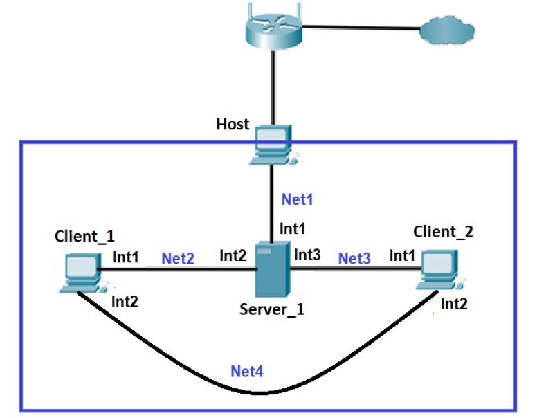
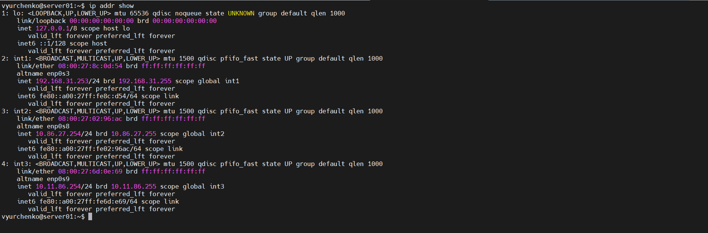
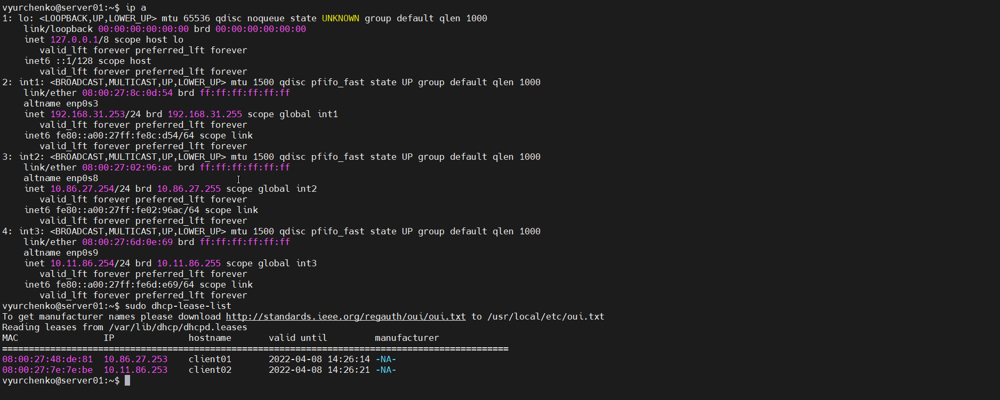
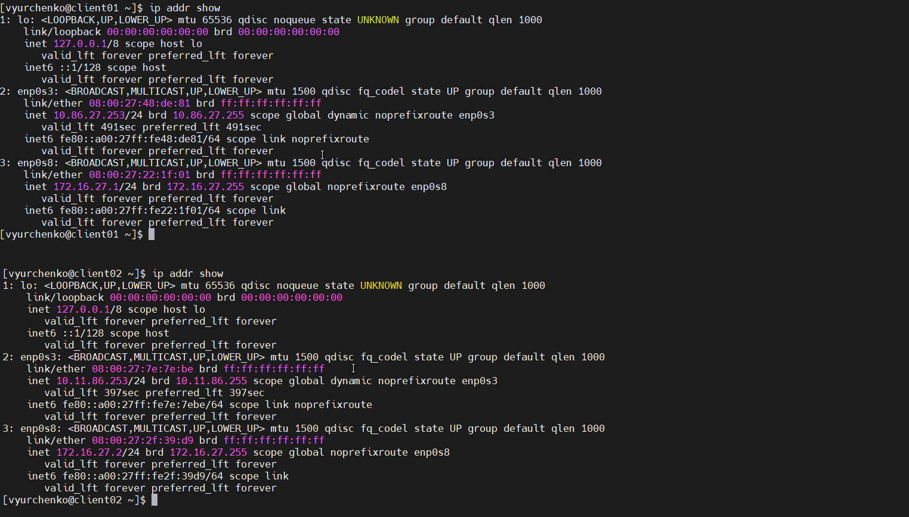
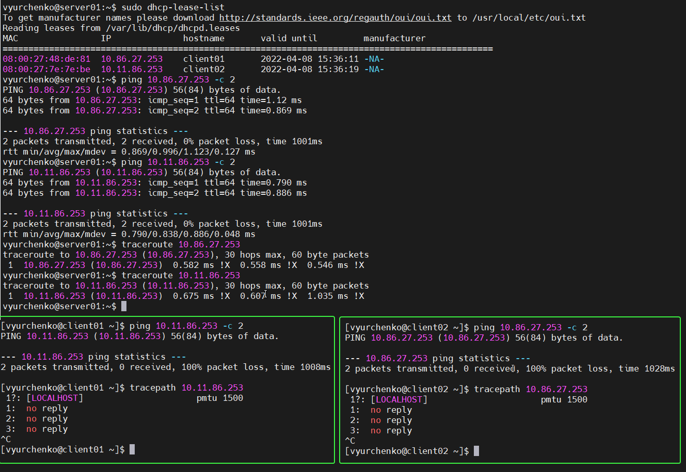

##### EPAM University Programs DevOps external course

# Module – Linux Networking [Task 5]

Практична частина модуля Linux Networking передбачає створення засобами Virtual Box мережі, що показаний на рисунку 1



рисунку 1

Host – це комп’ютер, на якому запущений Virtual Box;

Server_1 – Віртуальна машина, на якій розгорнуто ОС Linux. Int1 цієї машини в режимі «Мережевий міст» підключений до мережі Net1, тобто знаходиться в адресному просторі домашньої мережі. IP-адреса Int1 встановлюється статично відповідно до адресного простору, наприклад 192.168.1.200/24. Інтерфейси Int2 та Int3 відповідно підключено в режимі «Внутрішня мережа» до мереж Net2 та Net3.

Client_1 та Client_2 – Віртуальні машини, на яких розгорнуто ОС Linux (бажано різні дистрибутиви, наприклад Ubuntu та CentOS). Інтерфейси підключені в режимі «Внутрішня мережа» до мереж Net2, Net3 та Net4 як показано на рисунку 1.

Адреса мережі Net2 – 10.Y.D.0/24, де Y – дві останні цифри з вашого року народження, D – дата народження.

Адреса мережі Net3 – 10.M.Y.0/24, де M – номер місяця народження.

Адреса мережі Net4 – 172.16.D.0/24.

__Увага!__ Якщо, адресний простір Net2, Net3 або Net4 перетинається з адресним простором Net1 – відповідну адресу можна змінити на власний розсуд.


1. На Server_1 налаштувати статичні адреси на всіх інтерфейсах.

```
Server_1:

sudo ip addr add 192.168.31.253/24 dev enp0s3
sudo ip route add default via 192.168.31.1

sudo apt install net-tools

sudo nano /etc/udev/rules.d/1-user-network.rules
KERNEL=="enp0s3", ,ATTR{address}=="08:00:27:8c:0d:54", NAME="int1"
KERNEL=="enp0s8", ,ATTR{address}=="08:00:27:02:96:ac", NAME="int2"
KERNEL=="enp0s9", ,ATTR{address}=="08:00:27:6d:0e:69", NAME="int3"

sudo nano /etc/network/interfaces
allow-hotplug int1
iface int1 inet static
address 192.168.31.253
netmask 255.255.255.0
gateway 192.168.31.1
dns-nameserver 192.168.31.1

# Net2 – 10.86.27.0/24:
allow-hotplug int2
iface int2 inet static
address 10.86.27.254
netmask 255.255.255.0
gateway 10.86.27.254
dns-nameserver 10.86.27.254

# Net3 – 10.11.86.0/24:
allow-hotplug int3
iface int3 inet static
address 10.11.86.254
netmask 255.255.255.0
gateway 10.11.86.254
dns-nameserver 10.11.86.254
```



2. На Server_1 налаштувати DHCP сервіс, який буде конфігурувати адреси Int1 Client_1 та Client_2





```
sudo apt install isc-dhcp-server
sudo systemctl restart isc-dhcp-server.service
sudo systemctl status isc-dhcp-server.service
sudo tail -f /var/log/syslog

sudo cp /etc/default/isc-dhcp-server{,.orig}
sudo nano /etc/default/isc-dhcp-server
INTERFACESv4="int2 int3"

sudo cp /etc/dhcp/dhcpd.conf{,.orig}
sudo nano /etc/dhcp/dhcpd.conf

default-lease-time 600;
max-lease-time 7200;
authoritative;

# Net2 – 10.86.27.0/24:
subnet 10.86.27.0 netmask 255.255.255.0 {
range 10.86.27.150 10.86.27.253;
option routers 10.86.27.254;
option domain-name-servers 10.86.27.254, 8.8.8.8;
option domain-name "mydomain.example";
}

# Net3 – 10.11.86.0/24:
subnet 10.11.86.0 netmask 255.255.255.0 {
range 10.11.86.150 10.11.86.253;
option routers 10.11.86.254;
option domain-name-servers 10.11.86.254, 8.8.8.8;
option domain-name "mydomain.example";
}

host client01 {
  hardware ethernet 08:00:27:48:de:81;
  fixed-address 10.86.27.253;
}

host client02 {
  hardware ethernet 08:00:27:7e:7e:be;
  fixed-address 10.11.86.253;
}

sudo systemctl restart isc-dhcp-server.service
sudo systemctl status isc-dhcp-server.service
sudo systemctl enable isc-dhcp-server.service

sudo dhcp-lease-list
```

3. За допомогою команд ping та traceroute перевірити зв'язок між віртуальними машинами. Результат пояснити.
Увага! Для того, щоб з Client_1 та Client_2 проходили пакети в мережу Internet (точніше щоб повертались з Internet на Client_1 та Client_2) на Wi-Fi Router необхідно налаштувати статичні маршрути для мереж Net2 та Net3



4. На віртуальному інтерфейсу lo Client_1 призначити дві ІР адреси за таким правилом: 172.17.D+10.1/24 та 172.17.D+20.1/24. Налаштувати маршрутизацію таким чином, щоб трафік з Client_2 до 172.17.D+10.1 проходив через Server_1, а до 172.17.D+20.1 через Net4. Для перевірки використати traceroute.

5. Розрахувати спільну адресу та маску (summarizing) адрес 172.17.D+10.1 та 172.17.D+20.1, при чому маска має бути максимально можливою. Видалити маршрути, встановлені на попередньому кроці та замінити їх об’єднаним маршрутом, якій має проходити через Server_1.

6. Налаштувати SSH сервіс таким чином, щоб Client_1 та Client_2 могли підключатись до Server_1 та один до одного.

7. Налаштуйте на Server_1 firewall таким чином:
• Дозволено підключатись через SSH з Client_1 та заборонено з Client_2
• З Client_1 на 172.17.D+10.1 ping проходив, а на 172.17.D+20.1 не проходив

8. Якщо в п.3 була налаштована маршрутизація для доступу Client_1 та Client_2 до мережі Інтернет – видалити відповідні записи. На Server_1 налаштувати NAT сервіс таким чином, щоб з Client_1 та Client_2 проходив ping в мережу Інтернет
