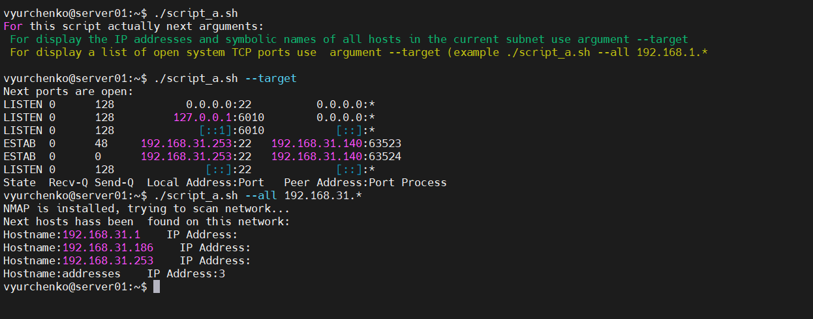
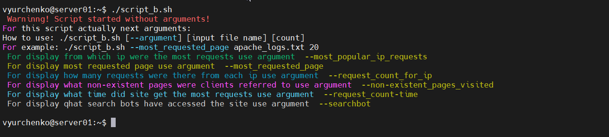
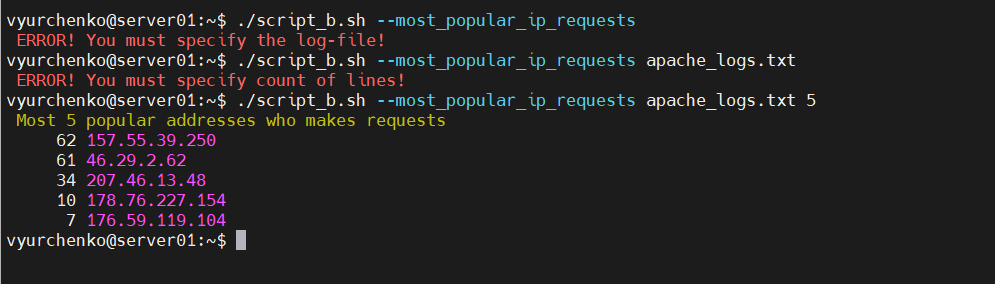
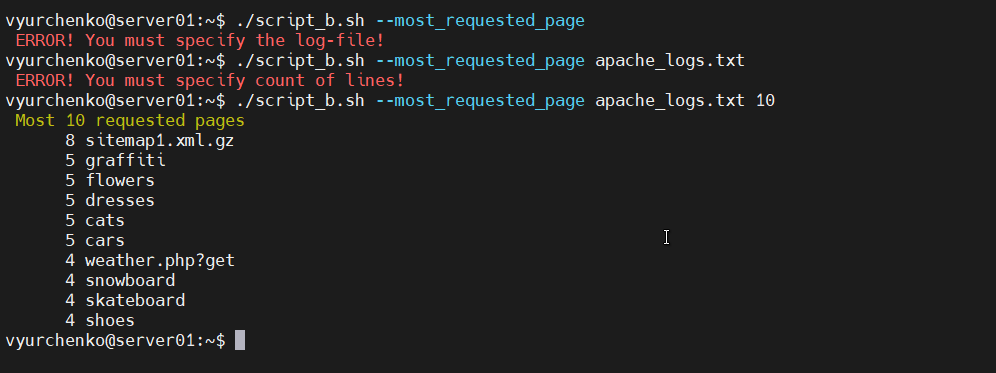

##### EPAM University Programs DevOps external course
# Module – Linux administration with bash. Home [task6.1]


A. Create a script that uses the following keys:
1. When starting without parameters, it will display a list of possible keys and their description.
2. The ```--all``` key displays the IP addresses and symbolic names of all hosts in the current subnet
3. The ```--target``` key displays a list of open system TCP ports.
The code that performs the functionality of each of the subtasks must be placed in a separate function

```
#!/usr/bin/env bash

#This function lists TCP opened TCP ports on host
function portscan
{
        echo "Next ports are open:"
        ss -ant | sort -k 4
}

# This function shows existing ip addresses and names in asked network
function netscan {
        # Checking what NMAP  is installed
        test -e /usr/bin/nmap
        if [[ "$?" == "0" ]]
        then
                echo "NMAP is installed, trying to scan network..."
        else
                echo "NMAP isn't installed, trying to install NMAP..."
                sudo apt install nmap  -y
        fi

# Perform scanning network with NMAP
        addr=$1
        echo "Next hosts hass been  found on this network:"
        nmap -sP $addr | awk 'NR % 2 == 0 {print "Hostname:" $5 "    " "IP Address:" $6}' | sed  's/(//g; s/)//g'
}

# This condition for written for display a list of possible keys and their description.
if [[ "$#" == "0" ]]
then
        echo "For this script actually next arguments:"
        echo -e "\033[32m For display the IP addresses and symbolic names of all hosts in the current subnet use argument --target"
        echo -e "\033[33m For display a list of open system TCP ports use  argument --target (example ./script_a.sh --all 192.168.31.*"
        echo -e "\033[0m"
        exit 0
fi


# Block  of script where is checking conditions of input parameter.
if [ "$1" == "--target" ]
then
        portscan

elif [ "$1" == "--all" ]
then
        netscan $2
fi
```

This is result of my script:



B. Using Apache log example create a script to answer the following questions:
1. From which ip were the most requests?
2. What is the most requested page?
3. How many requests were there from each ip?
4. What non-existent pages were clients referred to?
5. What time did site get the most requests?
6. What search bots have accessed the site? (UA + IP)

```
#!/usr/bin/env bash

#This displays which ip were the most requests
function mpir
{
        if [[ -z "$1" ]]
        then
                echo -e "\033[31m ERROR! You must specify the log-file! \033[0m"
                exit  0
        elif [[ -z "$2" ]]
        then
                echo -e "\033[31m ERROR! You must specify count of lines! \033[0m"
                exit 0
        fi
        logname=$1
        echo -e "\033[33m Most $2 popular addresses who makes requests \033[0m"
        cat $logname | grep -E -o '([0-9]{1,3}[\.]){3}[0-9]{1,3}' | sort | uniq -c | sort -gr | head -n $2

}

#This displays what is the most requested page
function mrp
{
        if [[ -z "$1" ]]
        then
                echo -e "\033[31m ERROR! You must specify the log-file! \033[0m"
                exit  0
        elif [[ -z "$2" ]]
        then
                echo -e "\033[31m ERROR! You must specify count of lines! \033[0m"
                exit 0
        fi
        logname=$1
        echo -e "\033[33m Most $2 requested pages \033[0m"
        cat $logname | awk '{print $7}' | sort | uniq -c | sort -gr | head -n $2 | sed 's/\///g'        
}

#This displays how many requests were there from each ip
function ripc
{
        if [[ -z "$1" ]]
        then
                echo -e "\033[31m ERROR! You must specify the log-file! \033[0m"
                exit  0
        elif [[ -z "$2" ]]
        then
                echo -e "\033[31m ERROR! You must specify count of lines! \033[0m"
                exit 0
        fi
        logname=$1
        echo -e "\033[33mHow many requests were there from each ip? \033[0m"
        cat $logname | grep -E -o "([0-9]{1,3}[\.]){3}[0-9]{1,3}" | sort | uniq -c | sort -gr | awk '{print "There is " "\033[33m" $1 "\033[0m" " requests from IP: " $2}' | head -n $2
}

#This displays what non-existent pages were clients referred to
function err404
{
        if [[ -z "$1" ]]
        then
                echo -e "\033[31m ERROR! You must specify the log-file! \033[0m"
                exit  0
        elif [[ -z "$2" ]]
        then
                echo -e "\033[31m ERROR! You must specify count of lines! \033[0m"
                exit 0
        fi
        echo -e "\033[33m What non-existent pages were clients referred to? \033[0m"
        echo -e "\033[33m These pages are non-existent: \033[0m"
        logname=$1
        grep "404 " $logname | awk '{print "There is \"" $7 "\" has been visited"}' | uniq | sed 's/\///g' | head -n $2
}

#This displays what time did site get the most requests
function reqcount
{
        if [[ -z "$1" ]]
        then
                echo -e "\033[31m ERROR! You must specify the log-file! \033[0m"
                exit  0
        elif [[ -z "$2" ]]
        then
                echo -e "\033[31m ERROR! You must specify count of lines! \033[0m"
                exit 0
        fi
        echo -e "\033[33m What time did site get the most requests? \033[0m"
        logname=$1
        cat $logname | awk '{print  "\033[36m requests makes on \033[0m " $4"]"}' | sort | uniq -c | sort -gr | head -n $2
}

#This displays what search bots have accessed the site? (UA + IP)
function searchbot
{
        if [[ -z "$1" ]]
        then
                echo -e "\033[31m ERROR! You must specify the log-file! \033[0m"
                exit  0
        elif [[ -z "$2" ]]
        then
                echo -e "\033[31m ERROR! You must specify count of lines! \033[0m"
                exit 0
        fi
        echo -e "\033[33m What search bots have accessed the site? (UA + IP)\033[0m"
        logname=$1
        cat $logname | awk '/bot/ {print $1, $12, $14, $15, $16}' | sort | uniq | awk '{print $1, $2, $3, $5}' | sort | uniq | sed 's/\"//g' | head -n $2
}


# This condition for written for display a list of possible keys and their description.
if [[ "$#" == "0" ]]
then
        echo -e "\033[31m Warninng! Script started without arguments! \033[0m"
        echo "For this script actually next arguments:"
        echo "How to use: ./script_b.sh [--argument] [input file name] [count]"
        echo "For example: ./script_b.sh --most_requested_page apache_logs.txt 20"
        echo -e "\033[32m For display from which ip were the most requests use argument \033[33m --most_popular_ip_requests"
        echo -e "\033[33m For display most requested page use argument \033[33m --most_requested_page"
        echo -e "\033[34m For display how many requests were there from each ip use argument \033[33m --request_count_for_ip"
        echo -e "\033[35m For display what non-existent pages were clients referred to use argument \033[33m --non-existent_pages_visited"
        echo -e "\033[36m For display what time did site get the most requests use argument \033[33m --request_count-time"
        echo -e "\033[37m For display qhat search bots have accessed the site use argument \033[33m --searchbot"
        echo -e "\033[0m"
        exit 0
fi


# Block  of script where is checking conditions of input parameter.
if [ "$1" == "--most_popular_ip_requests" ]
then
        mpir $2 $3

elif [ "$1" == "--most_requested_page" ]
then
        mrp $2 $3
elif [ "$1" == "--request_count_for_ip" ]
then
        ripc $2 $3
elif [ "$1" == "--non-existent_pages_visited" ]
then
        err404 $2 $3
elif [ "$1" == "--request_count-time" ]
then
        reqcount $2 $3
elif [ "$1" == "--searchbot" ]
then
        searchbot $2 $3
fi
```

And let's see how it works on screenshots:

Result of script without arguments:



Result of script with argument ```--most_popular_ip_requests```:

```
./script_b.sh --most_popular_ip_requests apache_logs.txt 5
```



Result of script with argument ```--most_requested_page```:

```
./script_b.sh --most_requested_page apache_logs.txt 10
```



C. Create a data backup script that takes the following data as parameters:
1. Path to the syncing directory.
2. The path to the directory where the copies of the files will be stored.
In case of adding new or deleting old files, the script must add a corresponding entry to the log file indicating the time, type of operation and file name. [The command to run the script must be added to crontab with a run frequency of one minute]