##### EPAM University Programs DevOps external course
# Module 7 - Database Administration  [task7.1]

PART 1
1. Download MySQL server for your OS on VM. 

```
# Updating Operating System
sudo apt update && sudo apt upgrade

# Install WGET package
sudo apt install wget -y

# Import the MySQL Repository
cd /tmp
wget https://dev.mysql.com/get/mysql-apt-config_0.8.18-1_all.deb
```

2. Install MySQL server on VM. 

```
# Install the release package
sudo dpkg -i mysql-apt-config_0.8.18-1_all.deb
```

During the MySQL repository installation, you will see the following pop-up windows:

Select Buster and press enter key:

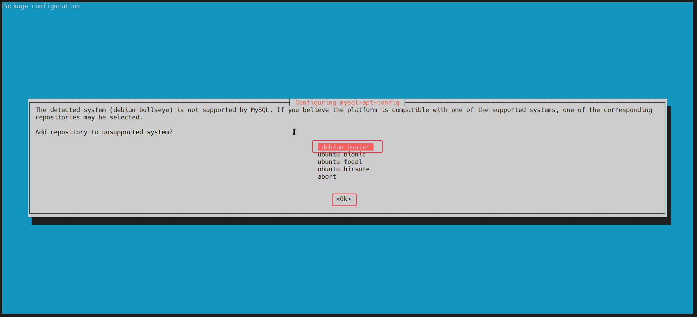

Select OK to proceed with the installation:

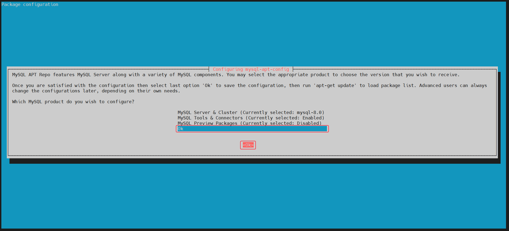

Once done, you will get the following message back in your terminal: ```OK```

To reflect the new repository, use the apt update command:

```sudo apt update```

Install MySQL 8:
```
sudo apt install mysql-server 
```
During the installation, a new popup will appear, prompting you to enter the database root password.

Once entered, press the __enter key or press tab key to select the ```<Ok>``` and hit enter__ to proceed with the installation:

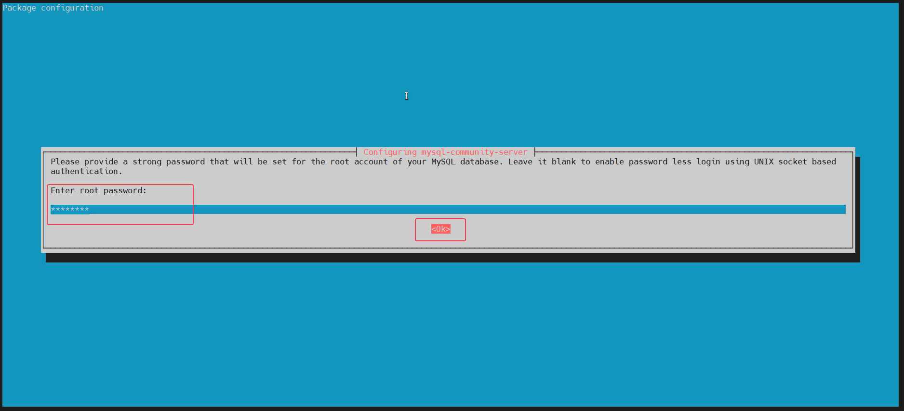

Note, you will be prompted to re-enter the root password a second time to confirm.

Next, another popup will appear for you to read about the new authentication system.

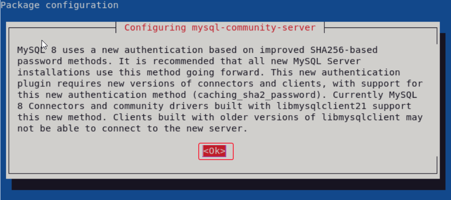

Next, set the default selection for MySQL for authentication plugin as below:

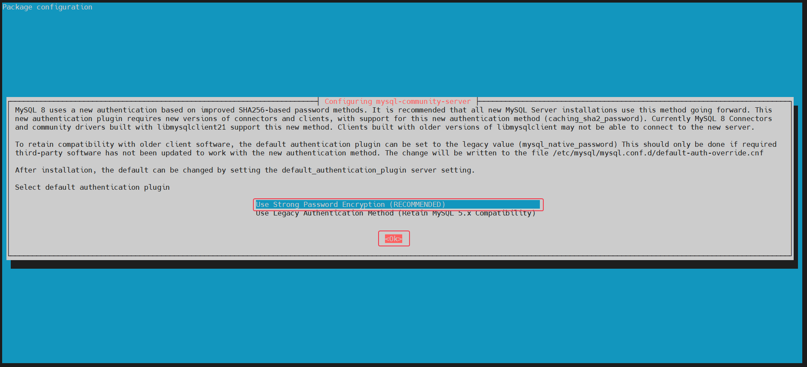

The installation should finish up after this point. To confirm it has been successfully installed, run the following apt policy command, which will also confirm the current version and build of the MySQL database server:

```
apt policy mysql-server
```
Example output:

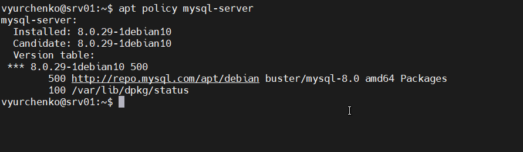

Check MySQL 8 server status:

```
sudo systemctl status mysql 
```

Example output:

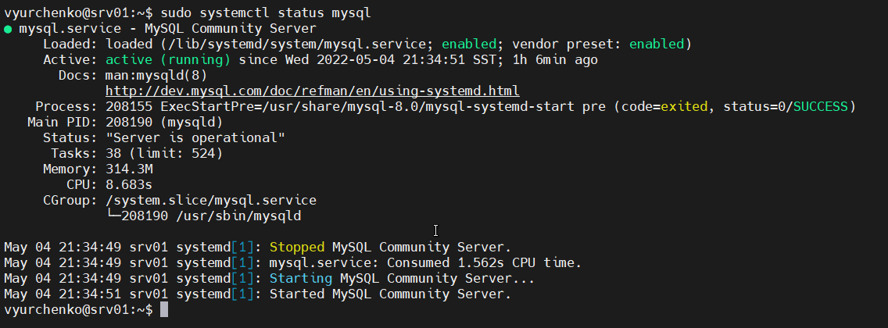

```
# To stop the MySQL service:
sudo systemctl stop mysql

# To start the MySQL service:
sudo systemctl start mysql

# To disable the MySQL service on system boot:
sudo systemctl disable mysql

# To enable the MySQL service on system boot:
sudo systemctl enable mysql

# To restart the MySQL service:
sudo systemctl restart mysql
```
Secure MySQL 8 with Security Script:

When installing __MySQL__ fresh, default settings are considered weak by most standards and cause concern for potentially allowing intrusion or exploiting hackers. A solution is to run the installation security script that comes with the __MySQL__ installation.

First, use the following command to launch the __(mysql_secure_installation)__:

```
sudo mysql_secure_installation
```

You will be prompted to enter your __root password, and then__ you will see a question about VALIDATE PASSWORD COMPONENT; this is to set password complexity checks; for most, the default is fine.

Next, follow below:

+ Setting the password for root accounts.
+ Removing root accounts that are accessible from outside the local host.
+ Removing anonymous-user accounts.
+  Removing the test database, which by default can be accessed by anonymous users.

Example Only:

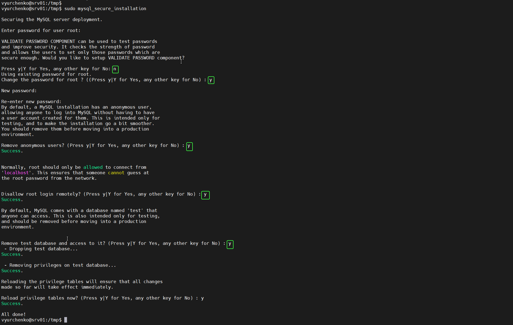


3. Select a subject area and describe the database schema, (minimum 3 tables) 

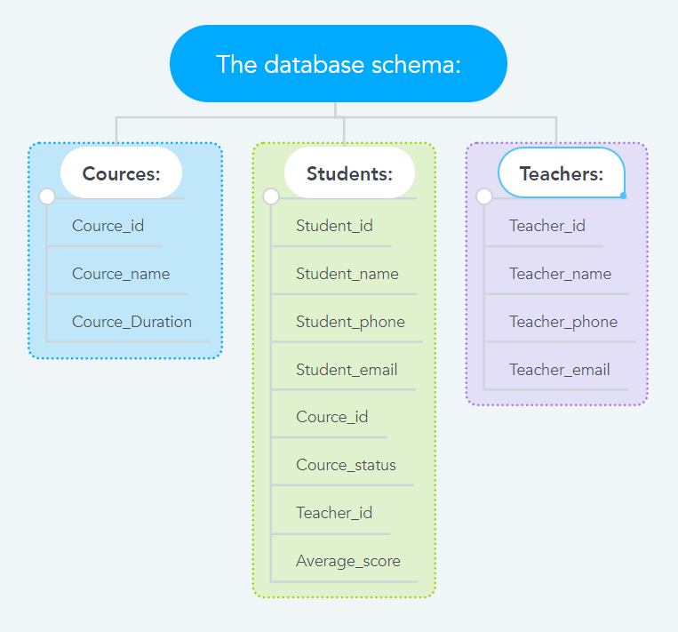

4. Create a database on the server through the console. 

```
sudo mysql -u root -p

mysql> show databases;
mysql> CREATE DATABASE TrainingEpam;
mysql> show databases;
```

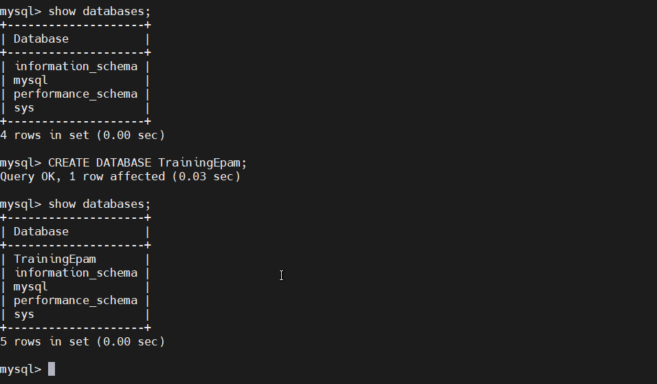

5. Fill in tables. 

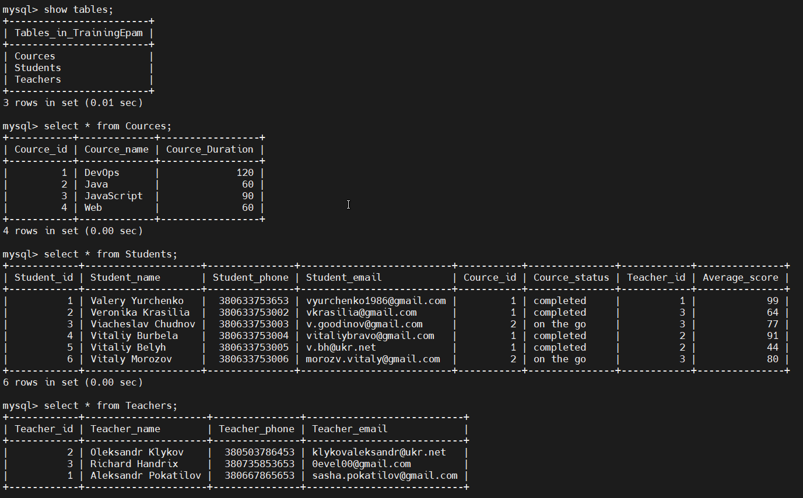

```
mysql> use TrainingEpam;

mysql> CREATE TABLE Students(
    Student_id INT NOT NULL,
    Student_name VARCHAR(100) NOT NULL,
    Student_phone BIGINT NOT NULL,
    Student_email VARCHAR(100) NOT NULL,
    Cource_id INT NOT NULL,
    Cource_status enum('on the go','completed'),
    Teacher_id INT NOT NULL,
    Average_score INT NOT NULL);

mysql> INSERT INTO Students(Student_id, Student_name, Student_phone, Student_email, Cource_id, Cource_status, Teacher_id, Average_score) VALUES(1, "Valery Yurchenko", 380633753653, "vyurchenko1986@gmail.com", 1, 'completed', 1, 99);
mysql> INSERT INTO Students(Student_id, Student_name, Student_phone, Student_email, Cource_id, Cource_status, Teacher_id, Average_score) VALUES(2, "Veronika Krasilia", 380633753002, "vkrasilia@gmail.com", 1, 'completed', 3, 64);
mysql> INSERT INTO Students(Student_id, Student_name, Student_phone, Student_email, Cource_id, Cource_status, Teacher_id, Average_score) VALUES(3, "Viacheslav Chudnov", 380633753003, "v.goodinov@gmail.com", 2, 'on the go', 3, 77);
mysql> INSERT INTO Students(Student_id, Student_name, Student_phone, Student_email, Cource_id, Cource_status, Teacher_id, Average_score) VALUES(4, "Vitaliy Burbela", 380633753004, "vitaliybravo@gmail.com", 1, 'completed', 2, 91);
mysql> INSERT INTO Students(Student_id, Student_name, Student_phone, Student_email, Cource_id, Cource_status, Teacher_id, Average_score) VALUES(5, "Vitaliy Belyh", 380633753005, "v.bh@ukr.net", 1, 'completed', 2, 44);
mysql> INSERT INTO Students(Student_id, Student_name, Student_phone, Student_email, Cource_id, Cource_status, Teacher_id, Average_score) VALUES(6, "Vitaly Morozov", 380633753006, "morozv.vitaly@gmail.com", 2, 'on the go', 3, 80);


mysql> CREATE TABLE Cources(
    Cource_id INT NOT NULL,
    Cource_name VARCHAR(100) NOT NULL,
    Cource_Duration INT NOT NULL);

mysql> INSERT INTO Cources(Cource_id, Cource_name, Cource_Duration) VALUES(1, "DevOps", 120);
mysql> INSERT INTO Cources(Cource_id, Cource_name, Cource_Duration) VALUES(2, "Java", 60);
mysql> INSERT INTO Cources(Cource_id, Cource_name, Cource_Duration) VALUES(3, "JavaScript", 90);
mysql> INSERT INTO Cources(Cource_id, Cource_name, Cource_Duration) VALUES(4, "Web", 60);


mysql> CREATE TABLE Teachers(
    Teacher_id INT NOT NULL,
    Teacher_name VARCHAR(100) NOT NULL,
    Teacher_phone BIGINT NOT NULL,
    Teacher_email VARCHAR(100) NOT NULL);

mysql> INSERT INTO Teachers(Teacher_id, Teacher_name, Teacher_phone, Teacher_email) VALUES(1, "Aleksandr Pokatilov", 380667865653, "sasha.pokatilov@gmail.com");
mysql> INSERT INTO Teachers(Teacher_id, Teacher_name, Teacher_phone, Teacher_email) VALUES(2, "Oleksandr Klykov", 380503786453, "klykovaleksandr@ukr.net");
mysql> INSERT INTO Teachers(Teacher_id, Teacher_name, Teacher_phone, Teacher_email) VALUES(3, "Richard Handrix", 380735853653, "0evel00@gmail.com");

mysql> show tables;
mysql> select * from Cources;
mysql> select * from Students;
mysql> select * from Teachers;
```

6. Construct and execute SELECT operator with WHERE, GROUP BY and ORDER BY. 


```
mysql> USE TrainingEpam;
mysql> DESCRIBE Students;
mysql> SELECT * FROM Students;

mysql> SET SESSION sql_mode='';
mysql> SELECT Student_id, Student_name, Student_email, AVG(Average_score) FROM Students WHERE Cource_status='completed' GROUP BY Student_name ORDER BY AVG(Average_score);

```

Executed some other SQL queries:

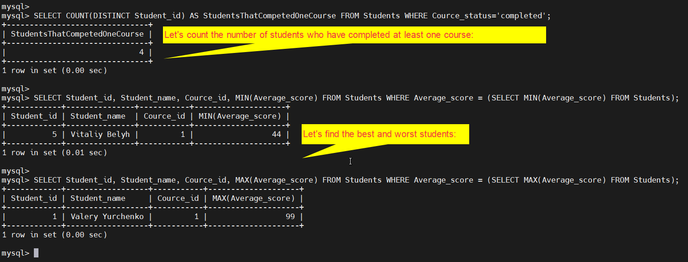

```
# Let's count the number of students who have completed at least one course:

mysql> SELECT COUNT(DISTINCT Student_id) AS StudentsThatCompetedOneCourse FROM Students WHERE Cource_status='completed';

# Let's find the best and worst students:

mysql> SELECT Student_id, Student_name, Cource_id, MIN(Average_score) FROM Students WHERE Average_score = (SELECT MIN(Average_score) FROM Students);

mysql> SELECT Student_id, Student_name, Cource_id, MAX(Average_score) FROM Students WHERE Average_score = (SELECT MAX(Average_score) FROM Students);
```

7. Execute other different SQL queries DDL, DML, DCL. 


These SQL commands are mainly categorized into four categories as: 

+ DDL – Data Definition Language
+ DQl – Data Query Language
+ DML – Data Manipulation Language
+ DCL – Data Control Language

+ Though many resources claim there to be another category of SQL clauses TCL – Transaction Control Language.

Example DDL commands:
```
# This query will create a new database in SQL and name the database as my_database.

mysql> CREATE DATABASE my_database;
```
 
Example DQL commands:

```
# To fetch the entire table or all the fields in the table:

mysql> SELECT * FROM table_name;
```

Example DML commands:

```
# Inserting all columns of a table: We can copy all the data of a table and insert into in a different table.

mysql> INSERT INTO first_table SELECT * FROM second_table;

# first_table: name of first table.
# second_table: name of second table. 
```

Example DCL commands:

```
# Granting SELECT Privilege to a User in a Table: To grant Select Privilege to a table named “users” where User Name is Amit, the following GRANT statement should be executed.

mysql> GRANT SELECT ON Users TO'Amit'@'localhost;
```

Example TCL commands:

```
# Following is an example which would delete those records from the table which have age = 20 and then COMMIT the changes in the database. 
Queries: 
 
mysql> DELETE FROM Student WHERE AGE = 20;
mysql> COMMIT;
```

8. Create a database of new users with different privileges. Connect to the database as a new user and verify that the privileges allow or deny certain actions. 

Let's create users with names Aleksandr, Danyil, Matvii, Valery:

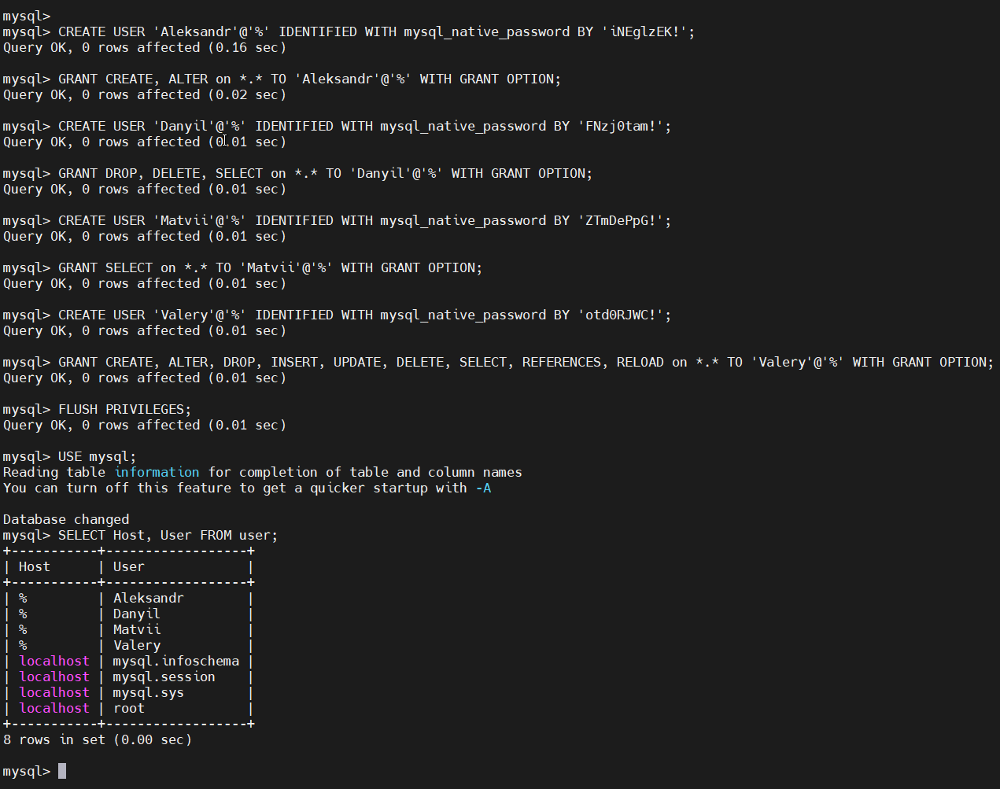

```
mysql> CREATE USER 'Aleksandr'@'%' IDENTIFIED WITH mysql_native_password BY 'iNEglzEK!';

mysql> GRANT CREATE, ALTER on *.* TO 'Aleksandr'@'%' WITH GRANT OPTION;

mysql> CREATE USER 'Danyil'@'%' IDENTIFIED WITH mysql_native_password BY 'FNzj0tam!';

mysql> GRANT DROP, DELETE, SELECT on *.* TO 'Danyil'@'%' WITH GRANT OPTION;

mysql> CREATE USER 'Matvii'@'%' IDENTIFIED WITH mysql_native_password BY 'ZTmDePpG!';

mysql> GRANT SELECT on *.* TO 'Matvii'@'%' WITH GRANT OPTION;

mysql> CREATE USER 'Valery'@'%' IDENTIFIED WITH mysql_native_password BY 'otd0RJWC!';

mysql> GRANT CREATE, ALTER, DROP, INSERT, UPDATE, DELETE, SELECT, REFERENCES, RELOAD on *.* TO 'Valery'@'%' WITH GRANT OPTION;

mysql> FLUSH PRIVILEGES;

mysql> USE mysql;

mysql> SELECT Host, User FROM user;
mysql> quit
```

OK, now let's check users privilegies on a practic:

Sammy have a rights to create tables and modify\add columns.

```
mysql -u Aleksandr -p"iNEglzEK!"

mysql> use vyurchenko;

mysql> select * from Students;

mysql> CREATE TABLE myTestTable01(
    id INT NOT NULL,
    lastname VARCHAR(100) NOT NULL,
    firstname VARCHAR(100) NOT NULL);

mysql> quit
```
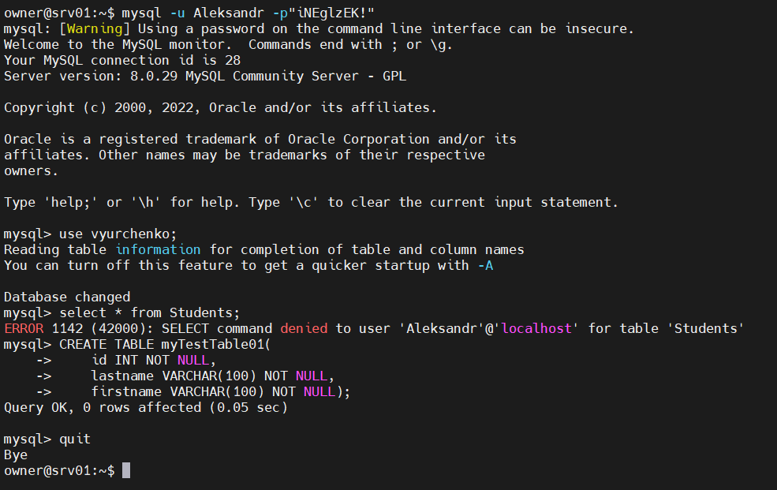

Danyil have rights to Delete some data from tables, delete tables and view info in tables.

```
mysql -u Danyil -pFNzj0tam!
mysql> use vyurchenko;
mysql> select * from Students;
mysql> update Students set  Student_email="test@ukr.net",  Student_phone="380630000000" where Student_id=5;
mysql> delete from Students where Student_id=5;
mysql> quit
```

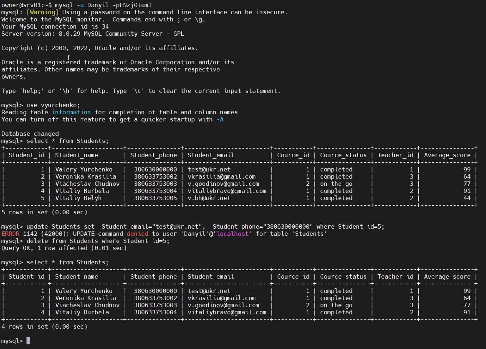

Matvii have only viewing right.

```
mysql -u Matvii -pZTmDePpG!

mysql> use vyurchenko;

mysql> select * from Students;

mysql> CREATE TABLE myTestTable02(
        id INT NOT NULL,
        lastname VARCHAR(100) NOT NULL,
        firstname VARCHAR(100) NOT NULL);

mysql> update Students set  Student_email="test@ukr.net",  Student_phone="380630000000" where Student_id=4;

mysql> delete from Students where Student_id=4;

mysql> quit
```

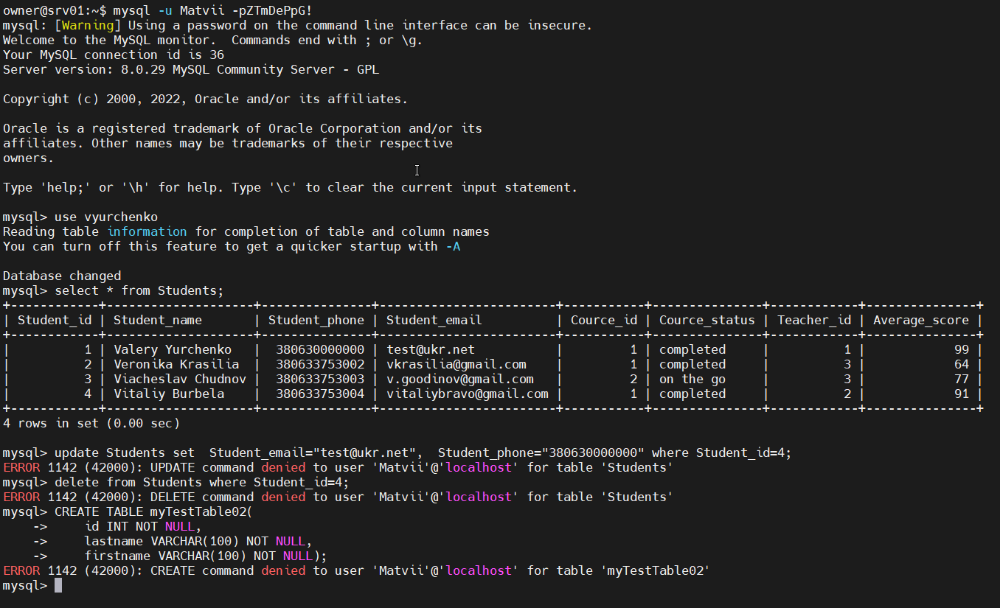

And Valery have all rights for this database

```
mysql -u Valery -potd0RJWC!

mysql> use vyurchenko;

mysql> select * from Students;

mysql> INSERT INTO Students(Student_id, Student_name, Student_phone, Student_email, Cource_id, Cource_status, Teacher_id, Average_score) VALUES(6, "Vitaly Morozov", 380633753006, "morozv.vitaly@gmail.com", 2, 'on the go', 3, 80);

mysql> select * from Students;

mysql> select * from Students order by Student_id;

mysql> drop table Students;

mysql> quit
```

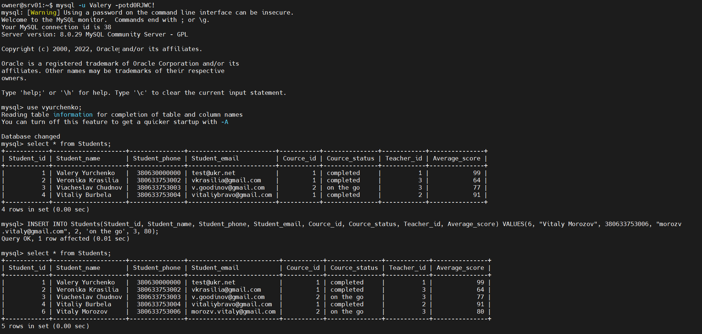

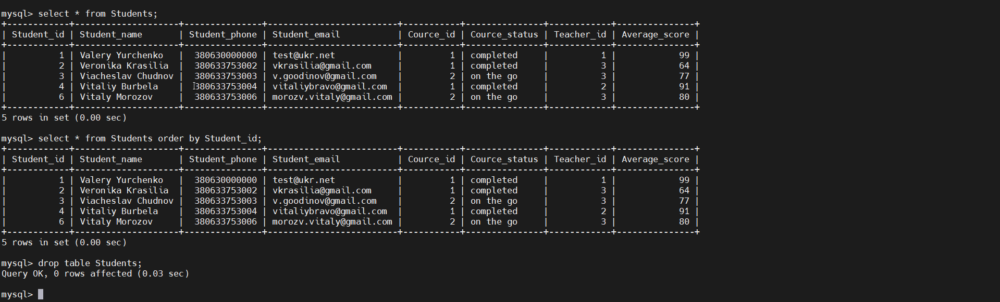

9. Make a selection from the main table DB MySQL.

```
mysql> use mysql

mysql> show tables;

mysql> SELECT user,authentication_string,plugin,host FROM mysql.user;

mysql> select * from db;

mysql> select * from global_grants;
```
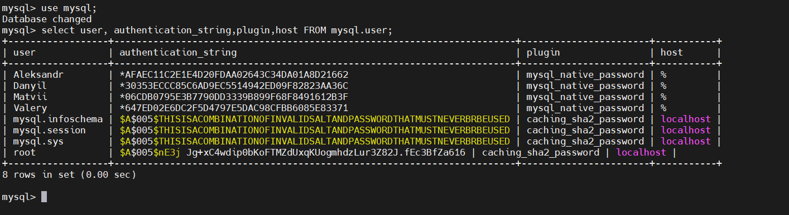

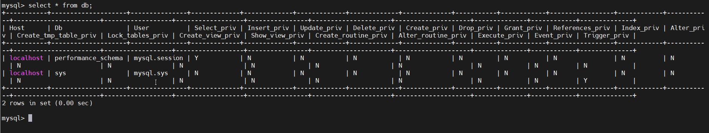


PART 2

10. Make backup of your database. 

11. Delete the table and/or part of the data in the table. 

12. Restore your database. 

13. Transfer your local database to RDS AWS. 

14. Connect to your database. 

15. Execute SELECT operator similar step 6. 

16. Create the dump of your database.

PART 3 – MongoDB

17. Create a database. Use the use command to connect to a new database (If it doesn't exist, Mongo will create it when you write to it). 

18. Create a collection. Use db.createCollection to create a collection. I'll leave the subject up to you. Run show dbs and show collections to view your database and
collections. 

19. Create some documents. Insert a couple of documents into your collection. I'll leave the subject matter up to you, perhaps cars or hats.

20. Use find() to list documents out.