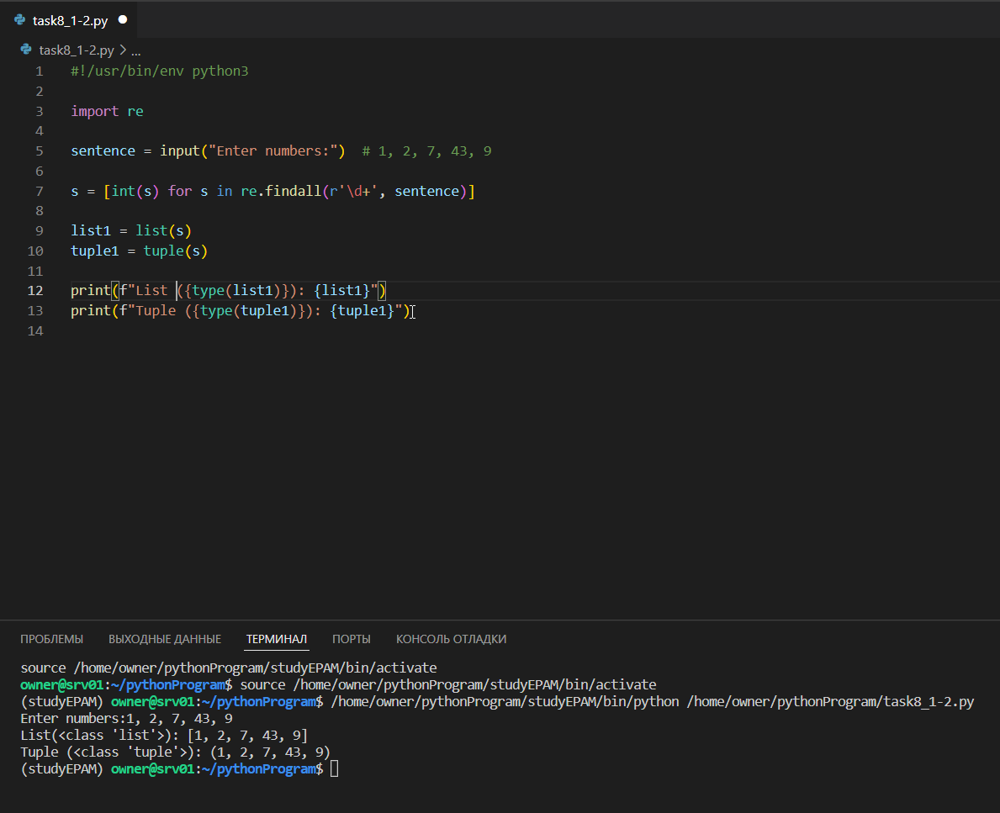
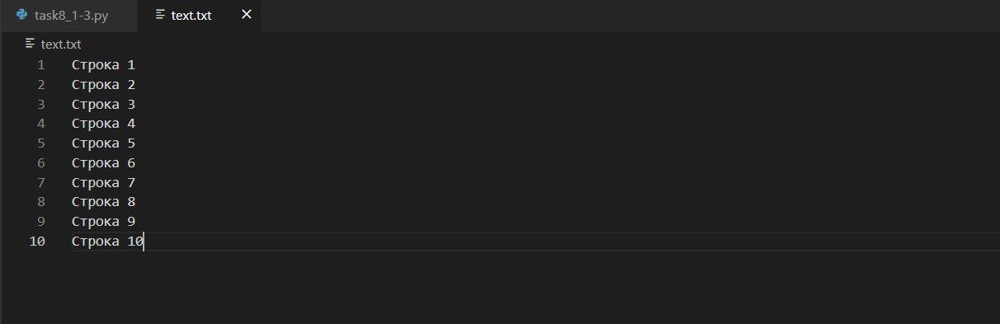
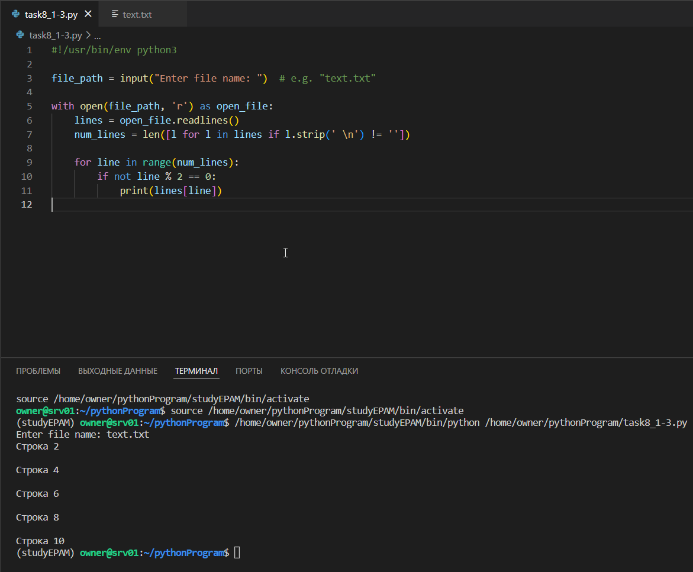

##### EPAM University Programs DevOps external course
# Module 8 - Python Intro  [task8.1]

PART 1

Python virtual environments:

```
mkdir pythonProgram && cd $_

ls -l

python3 -m venv studyEPAM

ls -l

source studyEPAM/bin/activate

deactivate
```


1. Write easy program, which will display current date and time.

```pip3 install pytz```


```
#!/usr/bin/env python3

import pytz
from datetime import datetime

tz = pytz.timezone('Europe/Kiev')
current_datatime = datetime.now(tz)
today = current_datatime.strftime("%Y-%m-%d %H:%M:%S")

print(f"Current date and time: {today}")
```


2. Write python program, which will accept comma-separated numbers, and then it
should write tuple and list of them:

Enter numbers: 1, 2, 7, 43, 9

Output:

List: ['1', '2', '7', '43', '9']

Tuple: ('1', '2', '7', '43', '9')

```
#!/usr/bin/env python3

import re

sentence = input("Enter numbers:")  # 1, 2, 7, 43, 9

s = [int(s) for s in re.findall(r'\d+', sentence)]

list1 = list(s)
tuple1 = tuple(s)

print(f"List ({type(list1)}): {list1}")
print(f"Tuple ({type(tuple1)}): {tuple1}")
```



3. Write python program, which will ask file name. File should be read, and only even lines should be shown.

```
#!/usr/bin/env python3

file_path = input("Enter file name: ")  # e.g. "text.txt"

with open(file_path, 'r') as open_file:
    lines = open_file.readlines()
    num_lines = len([l for l in lines if l.strip(' \n') != ''])

    for line in range(num_lines):
        if not line % 2 == 0:
            print(lines[line])
```





4. Write python program, which should read html document, parse it, and show it’s
title.

5. Write python program, which will parse user’s text, and replace some emotions with
emoji’s (Look: pip install emoji)

6. Write program, that will show basic PC information (OS, RAM amount, HDD’s, and etc.)